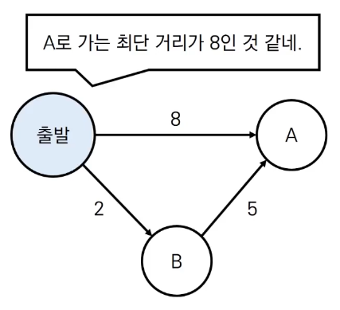
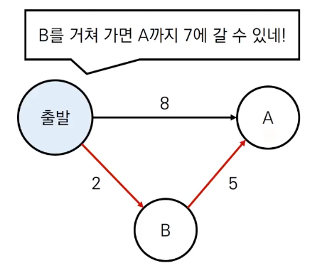
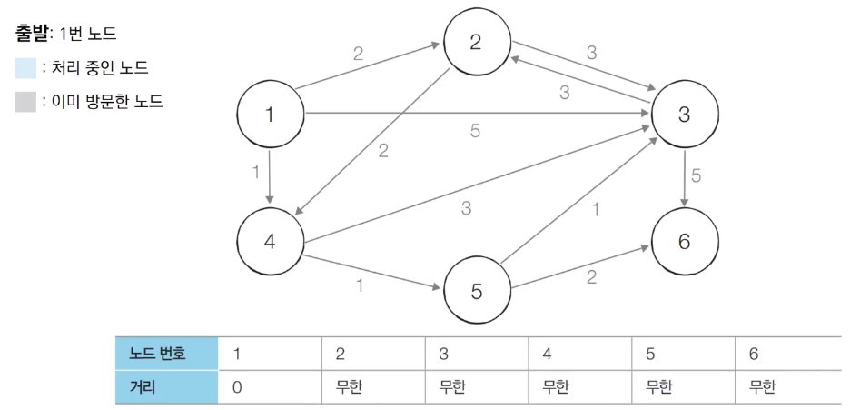
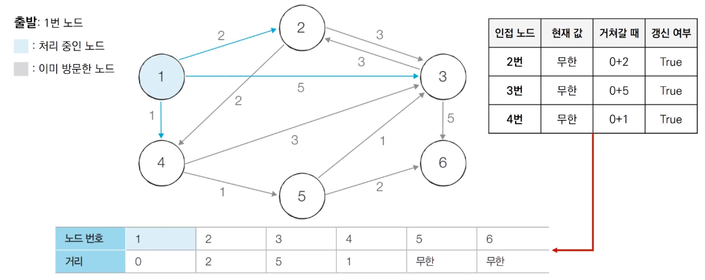
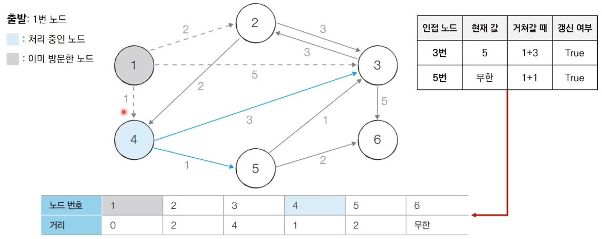
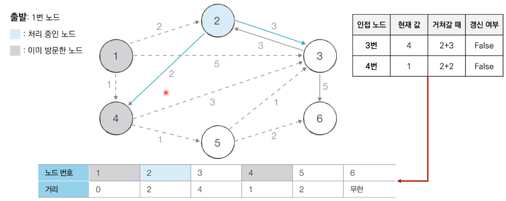
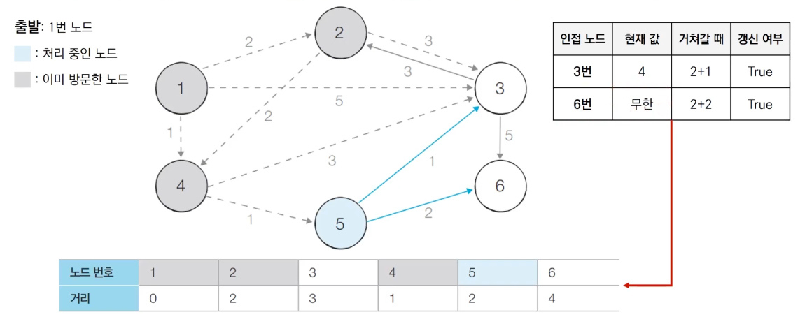
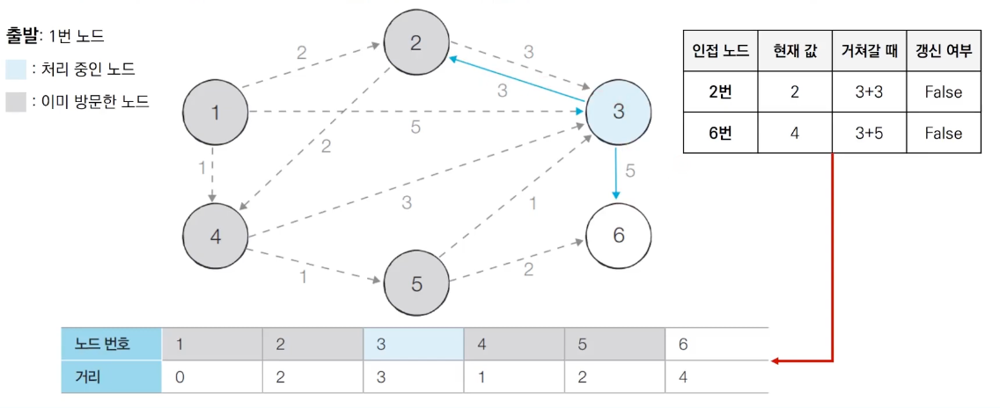
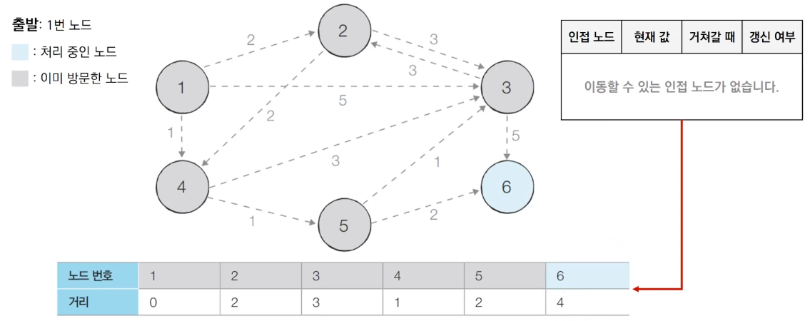

# Introduction

본 포스트는 알고리즘 학습에 대한 정리를 재대로 하기 위하여 남기는 것입니다. 더불어 기본 내용은 나동빈 저의 〖이것이 취업을 위한 코딩 테스트다〗라는 교재 및 유튜브 강의의 내용에서 발췌했고, 그 외 추가적인 궁금 사항들을 검색 및 정리해둔 것입니다.

# 최단 경로 알고리즘

## 개념


- 최단 경로 알고리즘은 **가장 짧은 경로를 찾는 알고리즘**을 의미합니다. 
- 다양한 문제 상황
	1. 한 지점에서 다른 한 지점 까지의 최단 경로
	2. 한 지점에서 다른 모든 지점까지의 최단 경로
	3. 모든 지점에서 다른 모든 지점까지의 최단 경로
- 각 지점의 그래프에서 <span style="color:red">노드</span>로 표현됩니다. 
- 각 지점 간 연결된 도로는 그래프에서 <span style="color:red">간선</span>으로 표현합니다. 

_노드 형태 예시_

## 다익스트라 최단 경로 알고리즘의 개요

- **특정한 노드**에서 출발하여 **다른 모든 노드**로 가는 최단 경로를 계산합니다. 
- 다익스트라 최단 경로 알고리즘은 음의 간선이 없을 때 정상 동작합니다. (현실세계 처럼 동작하며, 실 세계에서 사용 가능합니다.)
- 다익스트라 최단 경로 알고리즘은 그리디 알고리즘으로 분류됩니다. : **매 상황에서 가장 비용이 적은 노드를 선택** 하는 과정의 반복입니다. 
- 본래 최단 경로 알고리즘은 그 성격상 다이나믹 프로그래밍을 활용하는 경우가 있으나, 본 알고리즘은 매 순간 선택을 기준으로 하는 만큼 그리디적 특성이 있다고 기억하시면 됩니다. 
- 더불어 다익스트라라는 인물은 다양한 알고리즘을 만들었지만, 그 중 대표적인 것이 바로 다익스트라의 최단 경로 알고리즘이기에, 줄여서 다익스트라 알고리즘이라고 하면 바로 이 알고리즘을 의미합니다. 

## 알고리즘 동작 과정 

1. 출발 노드를 설정합니다. 
2. 최단 거리 테이블을 초기화 합니다. 
3. 방문하지 않은 노드 중에서 최단 거리가 가장 짧은 노드를 선택합니다. 
4. 해당 노드를 거쳐 다른 노드로 가는 비용을 계산하고 최단 거리 테이블을 갱신합니다. 
5. 위 과정에서 3번과 4번을 반복합니다.

- 그리디적 특성 및 동작과정에서 볼 수 있듯 단순히 방문하지 않은 노드까지에서 최단거리가 가장 짧은 노드를 선택할 뿐입니다. 즉, 추가적으로 전체 노드 사이에 최단거리 정보를 보려는 형태는 아닙니다. 각 노드 사이 최단 경로를 확보한 것 뿐이며, 이런 상황에서 완전한 최단 경로를 찾기 위해선 별도의 알고리즘이 추가적으로 들어가야 하며(혹은 다이나믹 프로그래밍으로 DP 테이블을 만들거나 하는 방식으로) 작성되어야 합니다. 
- 그러나 코딩 테스트를 생각하는 기준에서 본다면, 이는 많이 출제 되지 않으므로 본 강의에서는 단순 다른 노드까지의 최단거리를 구하는 것으로 하여 알고리즘을 설계및 구현합니다. 

- 알고리즘 동작 과정에서 최단 거리 테이블은 각 노드에 대한 현재까지의 최단 거리 정보를 가지고 있습니다. 
- 처리 과정에서 더 짧은 경로를 발견하면, 항상 최솟값으로 갱신하여 최종값을 확정 짓습니다. 

_바로 A를 가는 경우 8을 입력하고_
_B를 거쳐 갈 경우 7이 됨에 따라 갱신을 하고 최솟값으로 지정해둡니다._

## 동작과정 살펴보기 

0. 초기 상태 
	그래프를 준비하고 출발 노드를 설정합니다. 



1. 방문하지 않은 노드 중에서 최단 거리가 가장 짧은 1번 노드를 처리합니다. 



2. 방문하지 않은 노드 중 최단 거리가 가장 짧은 4번 노드를 처리합니다. 



- 4번 노드까지는 1번 노드에서의 최단 거리를 생각해 선택해 온 것으로 치고, 4번에서 갈 수 있는 노드 들에 대해 비교하는 모습닙니다. 

- 이때 핵심은 현재 값이 3번 노드로 갈때 `5`로 지정되어 있는데, 비교 값은 1번 노드에서 시작해서 온 값 + 4번에서 3번 노드를 가는 값 `1 + 3`과 비교한다는 점입니다. 

- 5번 노드로 가는 길의 경우 값이 `무한`으로 설정 되어 있으므로, 새로이 4에서 5번 노드로 가는 값 + 기본 1에서 4로 가는 최단거리를 더해 `2`로 갱신합니다. 

3. 방문하지 않은 노드 중 최단 거리가 가장 짧은 노드인 2번 노드를 처리합니다. 

- 여기서 핵심은, 실질적으로 4 ➡︎ 5 노드로 가는 것도 2이므로 같은 최솟값을 가지지만, 보통 이런경우 디폴트로 깊이가 덜 낮은 노드 먼저 진행하도록 짜야 합니다. 



- 2번 노드에서 3, 4번 노드를 갈 수 있습니다. 이 경우 값 비교시 기존의 값보다 커지기 때문에 갱신은 둘다 하지 않고 끝나고, 다음 노드를 선택합니다. 
- 여기서 기존에 직접 방문한 노드에 대해선 (예를 들면 4번 노드) 건너뛰게 만들수도 있습니다. 왜냐하면 방문이 처리 되면 그 순간 최소거리가 이미 지정되기 때문입니다. 

4. 방문하지 않은 노드 중 최단 거리가 가장 짧은 노드인 5번 노드를 처리합니다. 



5. 방문하지 않은 노드 중 최단 거리가 가장 짧은 노드인 3번 노드를 처리합니다. 마지막 노드 6의 경우 사실상 이미 모든게 끝난 상태이므로 마무리 합니다. 




## 다익스트라 알고리즘의 특징 

- 그리디 알고리즘 : **매 상황에서 방문하지 않은 가장 비용이 적은 노드를 선택**해 임의의 과정을 반복합니다. 
- 단계를 거치면서 한 번 처리된 노드의 최단거리는 고정이 됩니다. 
- 다익스트라 알고리즘이 수행되고 나면, 테이블에 각 노드까지의 최단거리 정보가 저장됩니다. 

## 다익스트라 알고리즘 : 간단한 구현 방법 

- 단계마다 1차원 테이블의 모든 원소를 확인(순차 탐색)하는 방법

```python
# Python 구현 예제
import sys
input = sys.stdin.readline
INF = int(1e9) # 무한을 의미하는 값으로 10억 설정

# 노드의 개수, 간선 개수 입력
n, m = map(int, input().split())
# 시작 노드 번호
start = int(input())
# 각 노드에 연결된 노드 정보 담은 리스트
graph = [[] for i in range(n + 1)]
# 방문한 노드 체크용 리스트
visited = [False] * (n + 1)
# 최단 거리 테이블을 모두 무한으로 초기화 
distance = [INF] * (n + 1)

# 모든 간선 정보 입력 받기
for _ in range(m):
	a, b, c = map(int, input().split())
	# a번 노드에서 b번 노드로 가는 비용이 c임
	graph[a].append((b, c))

# 방문 안 한 노드 중 최단 거리 노드 번호 반환
def get_smallest_node():
	min_value = INF 
	index = 0
	for i in range (1, n + 1):
		if distance[i] < min_value and not visited[i]:
			min_value = distance[i]
			index = i
	return index

def dijkstra(start):
	# 시작 노드에 대해서 초기화 
	distance[start] = 0
	visited[start] = True
	for j in graph[start]:
		distance[j[0]] = j[1]
	# 시작 노드를 제외한 전체 n - 1개의 노드에 대해 반복
	for i in range(n - 1):
		# 현재 최단 거리 노드, 방문 처리
		now = get_smallest_node()
		visited[now] = True
		# 현재 노드와 연결된 노드 확인
		for j in graph[now]:
			cost = distance[now] + j[1]
			# 다른 노드까지 이동 거리 비교, 작으면 만들어진 값으로 대입
			if cost < distance[j[0]]:
				distance[j[0]] = cost

dijkstra(start)

for i in range(1, n + 1):
	if distance[i] == INF:
		# 도달 할 수 없는 경우 무한 출력
		print("INFINITY")
	else :
		print(distance[i])
```

```cpp
// C++ 구현예제 
#include <bits/stdc++.h>
#define INF 1e9

using namespace std;

int n, m, start;
vector<par<int, int> > graph[100001];
bool visited[100001];
int d[100001];

int getSmallestNode()
{
	int min_value = INF;
	int index = 0;
	for (int i = 1; i <= n; i++)
	{
		if (d[i] < min_value && !visited[i])
		{
			min_value = d[i];
			index = i;
		}
	}
	return (index);
}

void dijkstra(int start)
{
	d[start] = 0;
	visited[start] = true;
	for (int j = 0; j < graph[start].size(); j++)
		d[graph[start][j].first] = graph[start][j].second;
	for (int i = 0; i < n - 1; i++)
	{
		int now = getSmallestNode();
		visited[now] = true;
		for (int j = 0; j < graph[now].size(); j++)
		{
			int cost = d[now] + graph[now][j].second;
			if (cost < d[graph[now][j].first])
				d[graph[now][j].first] = cost;
		}
	}
}

int main(void)
{
	cin >> n >> m >> start;

	for (int i = 0; i < m; i++)
	{
		int a, b, c;
		cin >> a >> b >> c;
		graph[a].push_back({b, c});
	}

	fill_n(d, 100001, INF);

	dijkstart(start);
	
	for (int i = 1; i <= n; i++)
	{
		if (d[i] == INF)
			cout << "INFINITY" << '\n';
		else 
			cout << d[i] << '\n';
	}
}

```

## 다익스트라 알고리즘 : 간단한 구현 방법 성능 분석

- 총 𝑂(𝑉)번에 걸쳐서 최단 거리가 가장 짧은 노드를 매번 선형 탐색합니다. (V는 노드 개수)
- 따라서 전체 시간 복잡도는 𝑂(𝑉²)입니다. 
- 일반적으로 코딩 테스트 전체 노드 개수가 5000개 이하라면 코드로 해결 가능하나, 노드 개수가 10000개가 넘어간다면 문제가 발생할 수 있습니다.
- 따라서 이를 위한 효율적인 자료구조 형태를 만들어 내고 코드가 작성되어야 합니다. 

TO BE CONTINUED....

[🧑🏻‍💻 알고리즘 박살내기 시리즈🧑🏻‍💻](https://paul2021-r.github.io/algorithm/20220411_00/)

```toc

```

