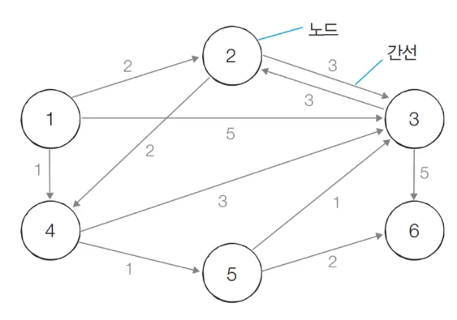
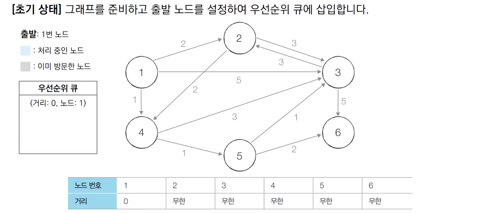
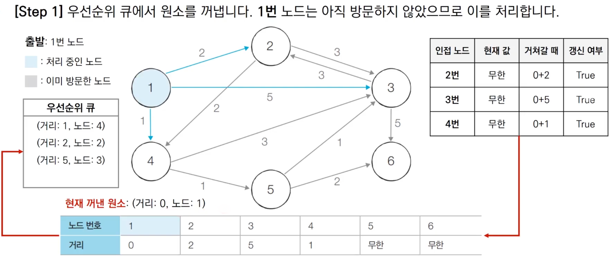
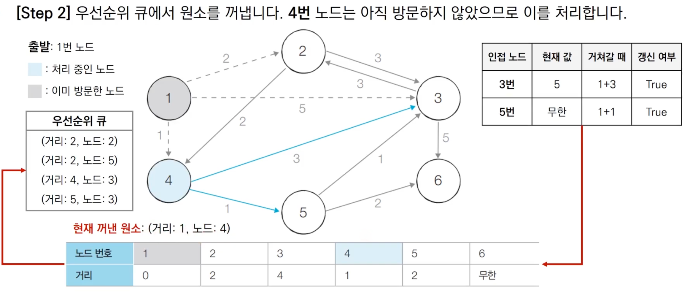
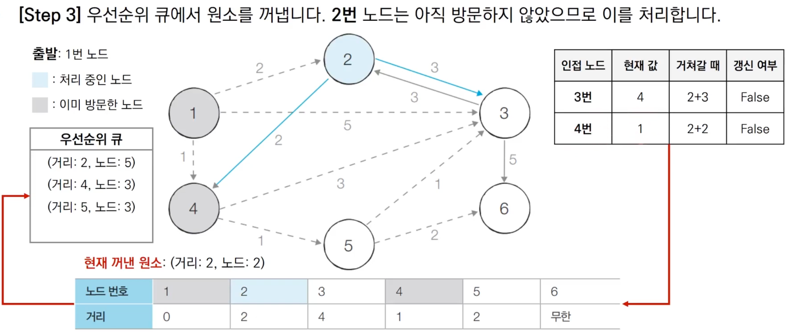
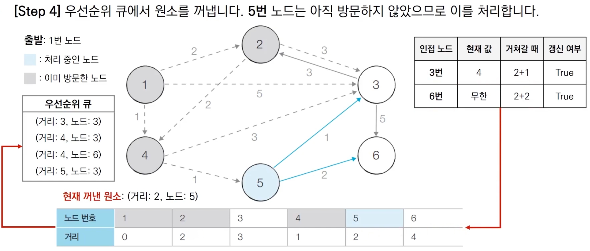
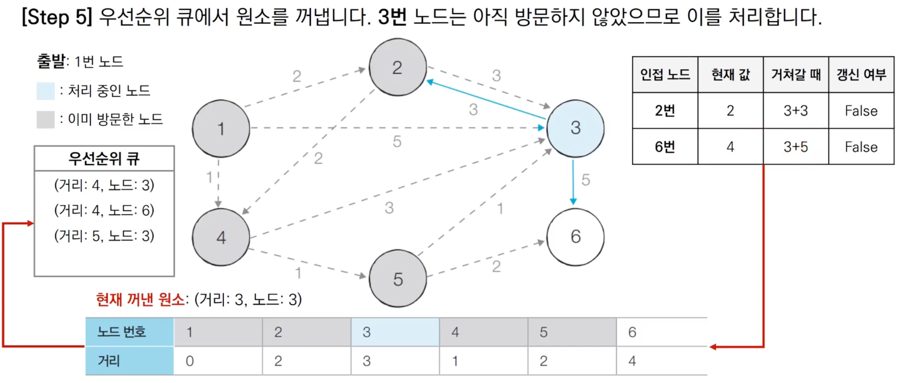
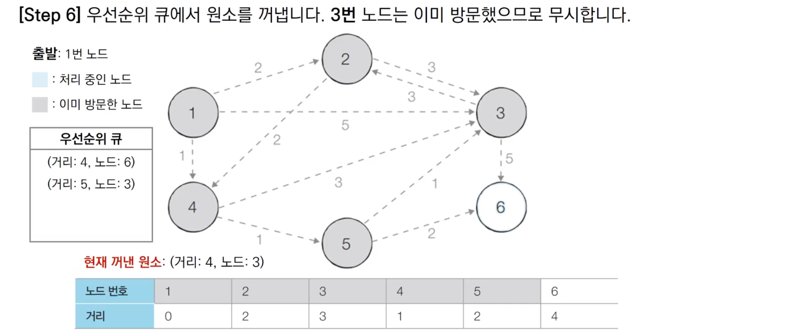
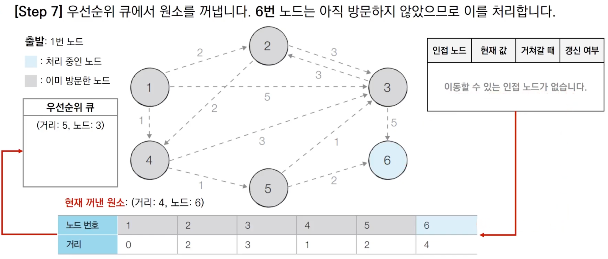
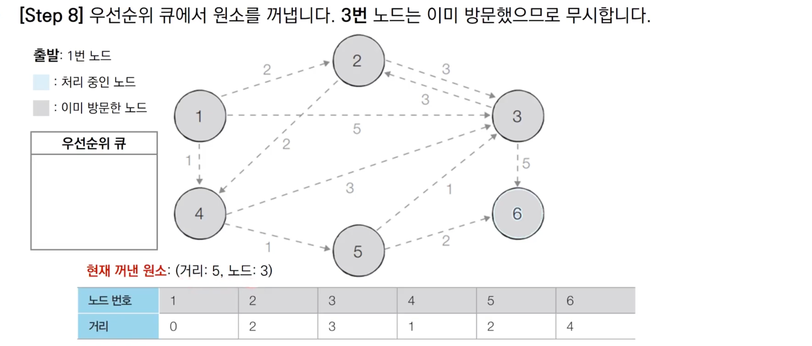

# Introduction


본 포스트는 알고리즘 학습에 대한 정리를 재대로 하기 위하여 남기는 것입니다. 더불어 기본 내용은 나동빈 저의 〖이것이 취업을 위한 코딩 테스트다〗라는 교재 및 유튜브 강의의 내용에서 발췌했고, 그 외 추가적인 궁금 사항들을 검색 및 정리해둔 것입니다.

# 최단 경로 알고리즘

## 개념


- 최단 경로 알고리즘은 **가장 짧은 경로를 찾는 알고리즘**을 의미합니다. 
- 다양한 문제 상황
	1. 한 지점에서 다른 한 지점 까지의 최단 경로
	2. 한 지점에서 다른 모든 지점까지의 최단 경로
	3. 모든 지점에서 다른 모든 지점까지의 최단 경로
- 각 지점의 그래프에서 <span style="color:red">노드</span>로 표현됩니다. 
- 각 지점 간 연결된 도로는 그래프에서 <span style="color:red">간선</span>으로 표현합니다. 

_노드 형태 예시_

## 간단한 구현 방법의 성능 분석

- 지난 포스팅에서 정리했던 간단한 구현 방법의 경우 선형 탐색으로 하나씩 확인하는 방식이었습니다. 그러다보니 최단 경로 알고리즘으로써 시간 복잡도는 전체 원소 개수의 제곱으로 나타나게 되면서 상당한 코스트가 소모됨을 보여주었습니다. 
- 노드 개수가 10000개를 넘어갈 경우 **10000² 만큼의 연산횟수**가 필요하다는 결론이 나게 되기에, 이를 개선할 필요가 있었습니다. 

## 우선순위 큐(Priority Que)

- 우선순위가 가장 높은 데이터를 가장 먼저 삭제하는 자료구조 입니다. 
- 예를들어 여러 개의 물건 데이터를 자료구조에 넣었다가, 가치가 높은 물건 데이터부터 꺼내서 확인해야 하는 경우 우선순위 큐를 이용할 수 있습니다. 
- Python, C++, Java를 포함한 대부분의 프로그래밍 언어에서 표준 라이브러리 형태로 지원합니다.

| **자료구조** | **추출되는 데이터** |
|:------------:|:-------------------:|
|스택(stack)   |가장 나중에 삽입된 데이터|
|큐(Que)       | 가장 먼저 삽입된 데이터|
|우선순위 큐(Priority Que)|가장 우선순위가 높은 데이터|

## 힙(Heap)

- 우선순위 큐를 구현하기 위해 사용하는 자료 구조 중 하나입니다. 
- 최소 힙(Min Heap), 최대 힙(Mac Heap)이 있습니다. 
- 다익스트라 최단 경로 알고리즘을 포함해 다양한 알고리즘에서 사용됩니다. 

| **우선순위 큐 구현 방식** | **삽입시간** | **삭제시간** |
|:--------------------------|:-------------|:-------------|
|리스트                     |𝑂(𝟏)          |𝑂(𝑵)          |
|힙(Heap)                   |𝑂(𝑙𝑜𝘨𝑵)       |𝑂(𝑙𝑜𝘨𝑵)       |

## 힙 라이브러리 사용 예제: 최소 힙

```python
import heapq

# 오름차순 힙 정렬(Heap Sort)
def heapsort(iterable):
	h = []
	result = []
	# 모든 원소를 차례대로 힙에 삽입
	for value in iterable:
		heapq.heappush(v, value)
	for i in range(len(h)):
		result.append(heap.heappop(h))
	return result

result = heapsort([1, 3, 5, 7, 8, 2, 4, 6, 8, 0])
print(result)

# 실행 결과
# [0, 1, 2, 3, 4, 5, 6, 7, 8, 9]
# 내장된 병합, 퀵 정렬 알고리즘과 같은 수준의 시간 복잡도를 보여줍니다. 
# 따라서 최악의 경우에도 동일한 시간 복잡도를 보장해줍니다.
```

## 힙 라이브러리 사용 예제: 최대 힙

```python
import heapq

# 내림차순 힙 정렬(Heap Sort)
def heapsort(iterable):
	h = []
	result = []
	# 모든 원소를 차례대로 힙에 삽입
	for value in iterable:
		heapq.heappush(v, -value) # 기본적으로 파이썬은 최대힙은 지원하지 않습니다. 
	for i in range(len(h)):
		result.append(-heap.heappop(h))
	return result

result = heapsort([1, 3, 5, 7, 8, 2, 4, 6, 8, 0])
print(result)

# 실행 결과
# [9, 8, 7, 6, 5, 4, 3, 2, 1, 0]
```

## 다익스트라 알고리즘: 개선된 구현 방법

- 단계마다 방문하지 않은 노드 중에 최단 거리가 가장 짧은 노드를 선택하기 위해 Heap 자료구조를 이용합니다. 
- 기본 동작 원리는 동일합니다. 단, 가장 가까운 노드를 저장하기 위해 힙 자료구조를 추가적으로 활용한다는 점이 차이점입니다. 
- 이때 최단 거리를 보는 것이므로 최소 힙을 사용합니다.

## 다익스트라 알고리즘: 동작 과정 살펴보기(우선순위 큐)



- 초기 상태에서 노드 1을 넣고 시작을 하며, 거리 값이 갱신 될 때 우선순위 큐에 집어 넣습니다. 
- 이때 핵심은 튜플 형식의 자료구조인데, 기존 간단한 방식과 달리 거리를 먼저 집어넣고, 노드 인덱스를 뒤로 집어 넣는 점입니다. 이를통해 우선순위를 지정하게 됩니다. 
- 그 외에 노드 테이블의 경우 노드 1번을 제외하고 무한으로 설정합니다.

- - -



- 1번 노드를 꺼내고 확인을 시작합니다. (방문 처리도 동시 진행함)
- 인접 노드에 대한 최단거리 값을 갱신합니다(2, 3, 4번 노드)
- 핵심은 갱신되는 여부에 따라 우선순위 큐에 집어 넣을지 말지를 결정하므로, 갱신된다 == 우선순위 큐에 들어가짐 이라고 생각하십시오. 

- - -



- 계속해서 우선순위 큐에 따라 다음 노드를 꺼내고, 이에 대한 다음 노드의 거리 갱신을 반복합니다. 

- - -



- 핵심은 진행 중 거쳐가는 값이 현재 거리보다 커서 갱신이 되지 않는 경우 우선순위 큐에 들어가지 않는다는 점입니다.

- - -


- - -


- - -


- 방문 처리를 했기에 재 연산을 생략해버립니다. 이로써  탐색을 하는 과정을 줄여줍니다.

- - -


- - -


## 다익스트라 알고리즘: 개선된 구현방법(Python)

```python
import heapq
import sys
input = sys.stdin.readline
INF = int(1e9)
# 무한을 의미하는 값으로 10억을 설정

# Node 개수, 간선의 개수를 입력받기
n, m = map(int, input().stdin())
# 시작 노드 번호를 입력받기
start = int(input())
# 각 노드에 연결된 정보 리스트
graph = [[] for i in range(n + 1)]
# 최단 거리 테이블
distance = [INF] * (n + 1)
# 해당 예제는 기존 방문 테이블이 따로 존재하지 않음

# 간선 정보를 입력 받는다.
for _ in range(m):
	# a번 노드에서 b번 노드로 가는 비용이 c 라는 의미
	a, b, c = map(int, input().split())
	graph[a].append((b, c))

def dijkstra(start):
	q = []
	# 시작 위치 설정
	heapq.heappush(q, (0, start))
	distance[start] = 0
	while q:
		dist, now = heapq.heappop(q):
		if distance[now] < dist: # 현재 지정된 노가 이미 처리되어 dist 값보다 작다면 처리 안함
			continue
		# 인접 노드 탐색
		for i in graph[now]:
			cost = dist + i[0]
			# 현재 해당 노드까지 가는데 걸리는 비용이 작은 경우 갱신
			if cost < distance[i[0]]
				distance[i[0]] = cost
				# 갱신의 핵심인 priority que 사용
				heapq.heappush(q, (cost, i[0]))

dijkstra(start)

for i in range(1, n + 1):
	if distance[i] = INF:
		print("INFINITY")
	else:
		print(distance[i])

```

## 다익스트라 알고리즘: 개선된 구현방법(C++)

```cpp
#include <std/bitsc++.h>
#define INF 1e9

using namespace std;

int n, m, start;
vector<pair<int, int>> graph[100001];
int d[100001];

void dijkstra(int start)
{
	priority_queue<pair<int, int>> pq;
	pq.push({0, start});
	d[start] = 0;
	while(!pq.empty())
	{
		int dist = -pq().first;
		int now = pq.top().second;
		pq.pop();
		if (d[now] < dist)
			continue ;
		if (cost < d[graph[now][i].first])
		{
			d[graph[now][i].first] = cost;
			pq.push(make_pair(-cost, graph[now][i].first));
			// 해당 라이브러리의 경우 파이선과 반대로 최대 힙으로 구성되어 있어 값을 음수로 집어 넣습니다. 
		}
	}
}

int main(void)
{
	cin >> n >> m >> start;

	for (int i = 0;, i < m; i++)
	{
		int a, b, c;
		cin >> a >> b >> c;
		graph[a].push_back({b, c});
	}

	fill(d, d + 10001, INF);

	dijkstra(start);

	for (int i = 1; i <= n; i++)
	{
		if (d[i] == INF)
			cout << "INFINITY" << '\n';
		else
			cout << d[i] << '\n';
	}
}

```

## 다익스트라 알고리즘: 개선된 구현 방법의 성능 분석 

- 힙 자료구조를 이용하면 시간 복잡도는 𝑂(𝑬𝑙𝑜𝘨𝑉) 입니다. 
- 노드를 하나씩 꺼내 검사하는 반복문은 노드의 개수 V 이상 횟수로 처리 되지 않습니다. 
- 결론으로 현재 우선순위 큐에서 꺼낸 노드와 연결된 다른 노드들을 확인하는 총 횟수는 최대 간선의 개수(E) 만큼 연산이 수행될 수 있습니다. 
- 단, 직관적으로 뒷 부분에서 더 이상 판단할 필요가 없는 원소가 발생한다는 점 등을 고려시 전체 과정은 E 개의 원소를 우선순위에 넣었다 빼는 연산과 유사합니다. 
- 따라서 시간 복잡도는 𝑂(𝑬𝑙𝑜𝘨𝑬)로 판단할 수 있습니다.
	- 중복간선을 포함하지 않는 경우에 이를 𝑂(𝑬𝑙𝑜𝘨𝑉)로 정리할 수 있습니다. 
	- 𝑂(𝑬𝑙𝑜𝘨𝑬) < 𝑂(𝑬𝑙𝑜𝘨𝑉²) == 𝑂(2𝑬𝑙𝑜𝘨𝑉) == 𝑂(𝑬𝑙𝑜𝘨𝑉) (빅오 표기법상 상수는 생략 됨)

[🧑🏻‍💻 알고리즘 박살내기 시리즈🧑🏻‍💻](https://paul2021-r.github.io/algorithm/20220411_00/)

```toc

```

