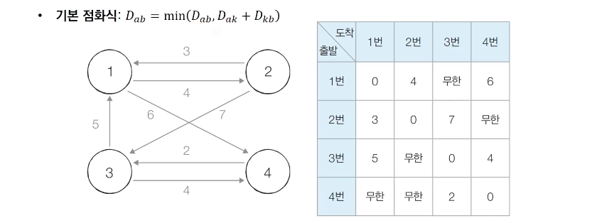
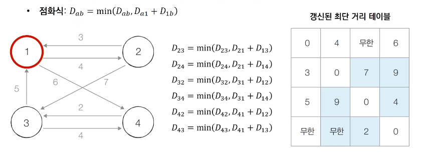
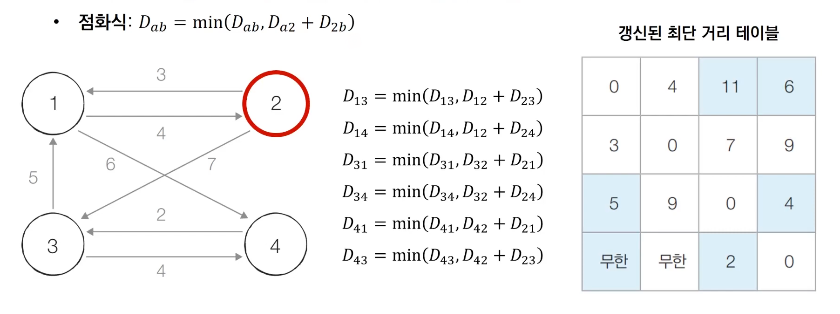
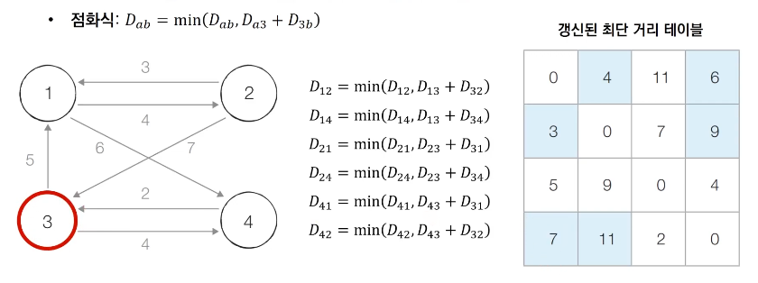
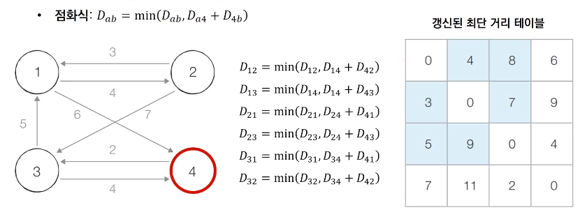

# Introduction

본 포스트는 알고리즘 학습에 대한 정리를 재대로 하기 위하여 남기는 것입니다. 더불어 기본 내용은 나동빈 저의 〖이것이 취업을 위한 코딩 테스트다〗라는 교재 및 유튜브 강의의 내용에서 발췌했고, 그 외 추가적인 궁금 사항들을 검색 및 정리해둔 것입니다.

# 플로이드 워셜 알고리즘 개요

## 개념 

- 모든 노드에서 다른 모든 노드까지의 최단 경로를 모두 계산합니다.
- 플로이드 워셜(Floyd-Warshall) 알고리즘은 다익스트라 알고리즘과 마찬가지로 단계별로 거쳐가는 노드를 기준으로 알고리즘을 수행합니다. -> 매 단계마다 방문하지 않은 노드 중에 최단 거리를 갖는 노드를 찾는 과정이 필요하지 않습니다. 
- 플로이드 워셜은 2차원 테이블에 최단 거리 정보를 저장합니다.
- 다이나믹 프로그래밍 유형에 속합니다. (점화식을 활용한 3중 반복문을 통해 구현이 이루어집니다.) 
- 난이도는 쉽지만, 그만큼 시간 복잡도가 𝑂(𝑁³)가 되는 만큼, 노드의 개수가 많아지고, 간선의 개수가 많다면 다익스트라 알고리즘이 추천됩니다. 

## 점화식 

- 각 단계마다 특정한 노드 k를 거쳐 가는 경우를 확인합니다.<br>
	➡︎ a에서 b로가는 최단거리보다 a에서 k를 거쳐 b로 가는 거리가 더 짧은지를 검사합니다. 
- 점화식 
<font size="+2">
<center>𝐷𝘢𝒃 = 𝑚𝑖𝑛(𝐷𝘢𝒃,𝐷𝘢𝘬 + 𝐷𝘬𝒃)</center></font><br>

## 플로이드 워셜 알고리즘 동작과정 살펴보기

0. 초기 상태 

- 그래프를 준비하고 최단 거리 테이블을 초기화 합니다. 
- 이때 각 출발 노드와 도착 노드가 1:1로 매칭 되는 경우 해당 거리를 입력, 나머지는 무한으로 처리합니다. 



- - -

1. 1번 노드를 처겨 가는 경우를 고려하여 테이블을 갱신합니다. 

- 1번을 거쳐 가는 경우를 고려하므로, 2번, 3번 노드에서 출발하여 가는 목적지 노드들만 점화식으로 비교 및 갱신됩니다. 



- - - 

2. 2번 노드를 거쳐 가는 경우를 고려하여 테이블을 갱신합니다. 



- - - 

3. 3번 노드를 거쳐 가는 경우를 고려하여 테이블을 갱신합니다. 



- - - 

4. 4번 노드를 거쳐 가는 경우를 고려하여 테이블을 갱신합니다. 



## 플로이드 워셜 알고리즘 예제 코드(Python)

```python
# 무한 상정
INF = int(1e9)

# 노드의 개수 및 간선의 개수를 입력 받기
n = int(input())
m = int(input())
# 2차원 그래프 리스트 만들기 및 무한 초기화
graph = [[INF] * (n + 1) for _ in range(n + 1)]

# 자기 자신으로 가는 경우를 0으로 초기화
for a in range(1, n + 1):
	for b in range(1, n + 1):
		if a == b:
			graph[a][b] = 0

# 각 간선의 정보를 입력 받기
for _ in range(m):
	# a노드에서 b노드로 가는데 걸리는 비용 c
	a, b, c = map(int, input().split())
	graph[a][b] = c

# 점화식에 따른 플로이드 워셜 알고리즘 사용
for k in range(1, n + 1):
	for a in range(1, n + 1):
		for b in range(1, n + 1):
			graph[a][b] = min(graph[a][b], graph[a][k] + graph[b][k])

# 출력 
for a in range(1, n + 1):
	for b in range(1, n + 1):
		if graph[a][b] == INF:
			print("INFINITY", end = " ")
		else :
			print(graph[a][b], end = " ")
	print()

```

## 플로이드 워셜 알고리즘 예제 코드(C++)

```cpp
#include <bits/stdc++.h>
#define INF 1e9

using namespace std;

int n, m
int graph[501][501];
// 해당 유형의 시간수행 복잡도를 생각할 때,
// 해당 유형 문제는 노드 개수가 500개 이상으로 구현하기 어렵습니다. 

int main(void)
{
	cin >> n >> m
	for (int i = 0; i < 501; i++)
		fill(graph[i], graph[i] + 501, INF);
	
	for (int a = 1; a <= n; a++)
		for (int b = 1; b <= n; b++)
			if (a == b)
				graph[a][b] = 0;

	for (int i = 0; i < m; i++)
		int a, b, c;
		cin >> a >> b >> c;
		graph[a][b] = c;

	for (int k = 1; k <= n; k++)
		for (int a = 1; a <= n; a++)
			for (int b = 1; b <= n; b++)
				graph[a][b] = min(graph[a][b], graph[a][k] + graph[k][b]);

	for (int a = 1; a <= n; a++)
	{	
		for (int b = 1; b <= n; b++)
		{
			if (graph[a][b] == INF)
				cout >> "INFINITY" >> ' ';
			else
				cout >> graph[a][b] >> ' ';
		}
		cout >> '\n';
	}
}
```

## 플로이드 워셜 알고리즘 성능 분석 

- 노드 개수가 N개 일 때 알고리즘 상 N번의 단계를 수행합니다.<br>
	➡︎ 각 단계마다 𝑂(𝑁²)의 연산을 통해 노드를 거쳐 가는 경우를 고려합니다. 
- 최종적으로 **𝑂(𝑁³)** 의 시간 복잡도를 갖게 됩니다.(노드 개수 500개만 되도 500 연산 시간↑)


[🧑🏻‍💻 알고리즘 박살내기 시리즈🧑🏻‍💻](https://paul2021-r.github.io/algorithm/20220411_00/)

```toc

```
