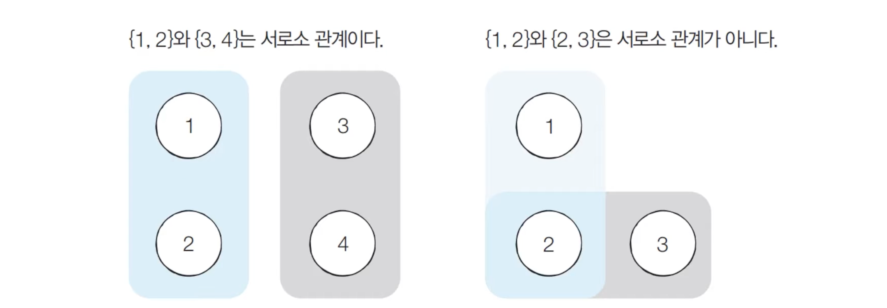
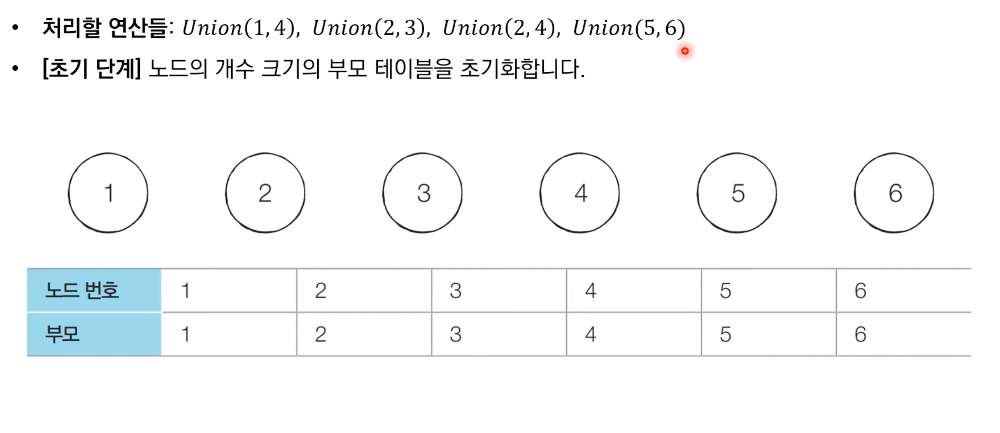
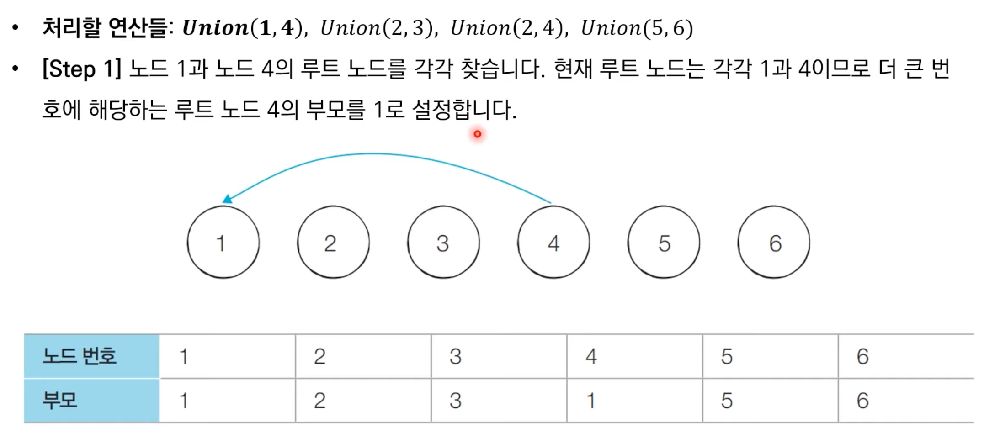
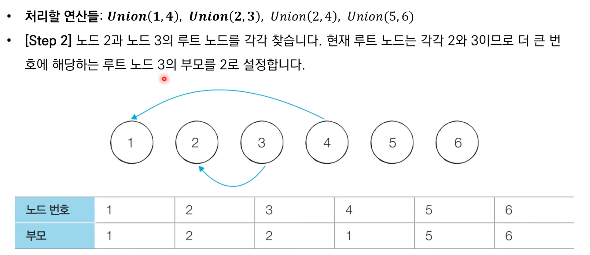
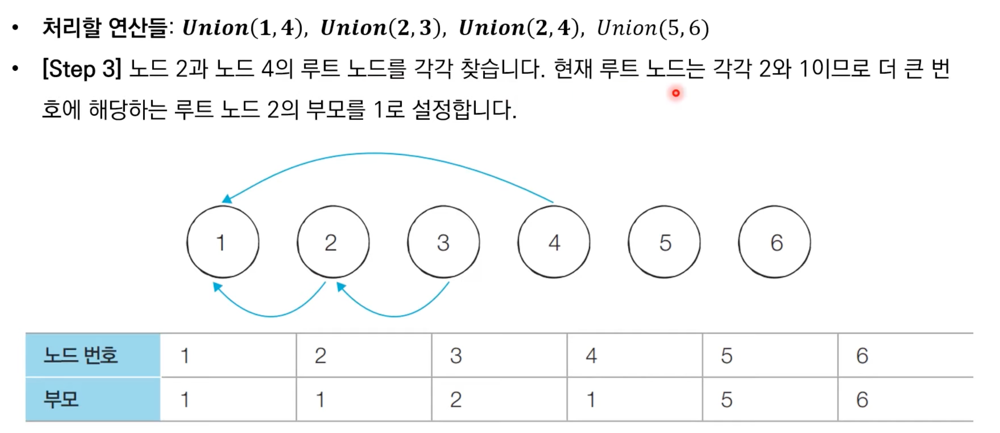
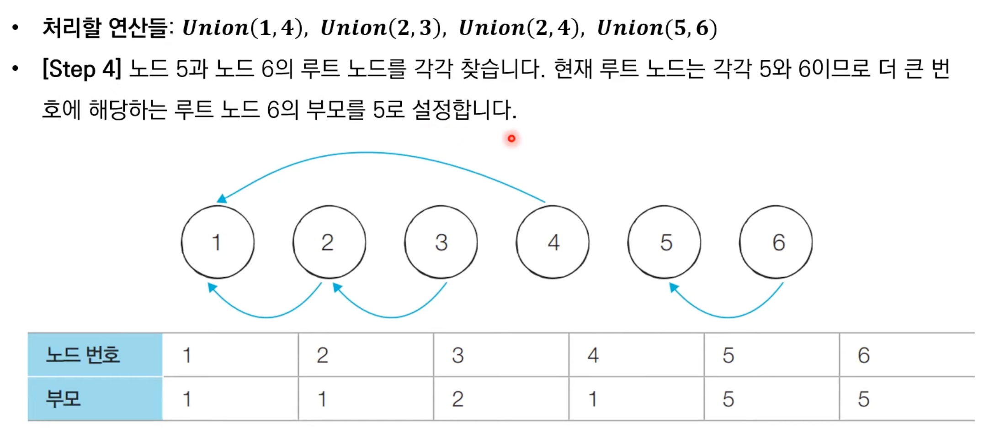
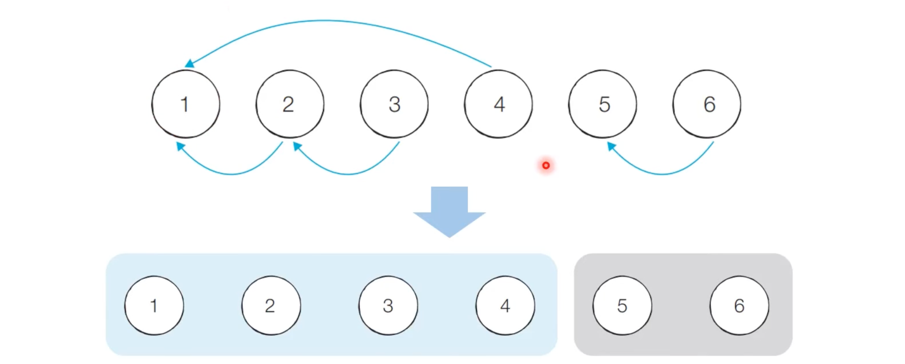
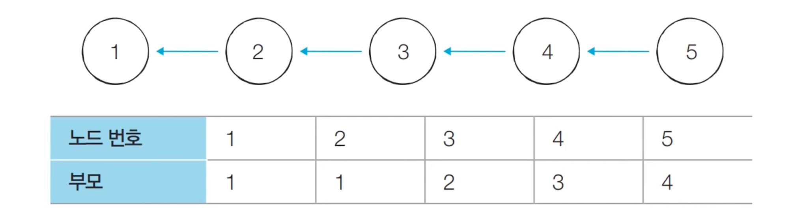
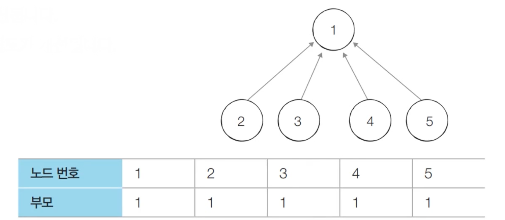

# Introduction

본 포스트는 알고리즘 학습에 대한 정리를 재대로 하기 위하여 남기는 것입니다. 더불어 기본 내용은 나동빈 저의 〖이것이 취업을 위한 코딩 테스트다〗라는 교재 및 유튜브 강의의 내용에서 발췌했고, 그 외 추가적인 궁금 사항들을 검색 및 정리해둔 것입니다.

# 기타 그래프 이론 : 서로소 집합 자료구조

## 서로소 집합

- 서로소 집합(Disjoint Sets)란 *공통 원소가 없는 두 집합*을 의미합니다.



## 서로소 집합 자료구조

- **서로소 부분 집합들로 나누어지 원소들의 데이터를 처리하기 위한 자료구조**입니다.
- 서로소 집합 자료구조는 두 종류의 연산을 지원합니다.
  1.  합집합(Union) : 두 집합의 원소들이 모두 포함된 하나의 집합으로 합치는 연산.
  2.  찾기(Find) : 특정 원소가 속한 집합을 알려주는 연산.
- 서로소 집합 자료구조는 **합치기 찾기(Union Find) 자료구조**라고도 불립니다.
- 여러 합치기 연산이 주어질 때 서로소 집합 자료구조의 동작 과과정
  1.  합집합 연산으로 연결된 두 노드 A, B 를 확인한다.
  2.  A와 B의 루트 노드 A', B'를 찾습니다.
  3.  A'를 B'의 부모 노드로 설정합니다.
  4.  모든 합집합 연산이 처리할 때까지 1~3번 과정을 반복합니다.

## 동작과정 살펴보기











## 연결성

- 기본적인 형태의 서로소 집합 자료구조에서는 루트 노드에 즉시 접근할 수 없습니다. : 루트 노드를 찾기 위해 부모 테이블을 찾아 계속 거슬러 올라갑니다.
- 아래 예시는 노드 3의 루트를 찾아가는 것을 보여줍니다.
  
  

## 기본적인 구현 방법(Python)

```python
# 특정 원소가 속한 집합을 찾기
def find_parent(parent, x):
	# 루트 노드가 아니면 재귀
	if parent[x] != x:
		return find_parent(parent, parent[x])
	return x

# 합집합 함수
def union_parent(parent, a, b):
	# 각 노드의 부모를 찾고
	a = find_parent(parent, a)
	b = find_parent(parent, b)
	# 작은 쪽이 상대의 부모 노드가 된다.
	if a < b:
		parent[b] = a
	else:
		parent[a] = b

# 노드의 개수와 간선(Union 연산 횟수)개수 입력
v, e = map(int, input().split())

# 부모 테이블을 초기화
parent = [0] * (v + 1)
for i in range(1, v + 1): # 1번부터 v번까지
	parent[i] = i # 최초 상태는 자기 자신이 부모

# 합집합 연산을 수행
for i in range(e):
	a, b = map(int, input().split())
	union_parent(parent, a, b)

# 출력
print('각 원소가 속한 집합: ', end=' ')
for i in range(1, v + 1):
	print(find_parent(parent, i), end=' ')
print()
print('부모 테이블: ', end=' ')
for i in range(1, v + 1):
	print(parent[i], end=' ')

# 실행한 결과
# 7 4
# 1 2
# 1 4
# 3 5
# 3 4
# 각 원소가 속한 집합:  1 1 1 1 1 6 7
# 부모 테이블:  1 1 1 1 3 6 7

```

## 기본적인 구현 방법(C++)

```cpp
// 해당 예제는 노드 개수를 10만개로 제한합니다.
#include <bits/stdc++.h>

using namespace std;

int v, e;
int parent[100001];

int findParent(int x)
{
	if (x == parent[x])
		return (x);
	return (findParent(parent[x]));

void UnionParent(int a, int b)
{
	a = findParent(a);
	b = findParent(b);
	if (a < b)
		parent[b] = a;
	else
		parent[a] = b;
}

int main(void)
{
	 cin >> v > e;

	for (int i = 1; i <= v; i++)
		parent[i] = i;

	cout << "각 원소가 속한 집합: ";
	for(int i = 1; i <= v; i++)
		cout << findParent(i) << ' ';
	cout << '\n';

	cout << "부모 테이블 :"
	for(int i = 1; i <= v; i++)
		cout << parent[i] << ' ';
	cout << '\n';
}
```

## 기본적인 구현 방법의 문제점

- 합집합 연산이 편향되게 이루어지는 경우 찾기(Find)함수가 비효율적으로 동작합니다.
- 최악의 경우 찾기 함수가 모든 노드를 다 확인하면서 시간 복잡도가 𝑂(𝑉)입니다.
  - 예를 들어 {1, 2, 3, 4, 5}의 총 5개 원소가 존재하는 경우
  - 연산 : Union(4, 5), Union(3, 4), Union(2, 3), Union(1, 2)(그림참조)
- 결론적으로 이러한 구조는 수행시간 측면에서 비효율적임을 알 수 있습니다.
  

## 경로 압축

- 찾기(Find) 함수를 최적화하기 위해 경로 압축(path Compression)을 이용할 수 있습니다.

- 찾기 함수를 재귀적으로 호출한 뒤 **부모 테이블 값을 바로 갱신**합니다.

```python
# Python 개선 코드
def find_parent(parent, x):
	if parent[x] != x:
		parent[x] = find_parent(parent, parent[x])
	return parent[x]
```

```cpp
int findParent(int x)
	if (x == parent[x])
		return (x);
	return parent[x] = findParent(parent[x]);

```

- 경로 압축 기법을 적용하면 각 노드에 대하여 찾기(Find) 함수를 호출한 이후에 해당 노드의 루트 노드가 바로 부모 노드가 됩니다.
- 동일한 예시에 대해서 모든 합집합(Union)함수를 처리한 후 각 원소에 대하여 찾기(Find) 함수를 수행하면 다음과 같이 부모 테이블이 갱신됩니다. 이를통해 시간 복잡도 개선이 가능합니다.
  

[🧑🏻‍💻 알고리즘 박살내기 시리즈🧑🏻‍💻](https://paul2021-r.github.io/algorithm/20220411_00/)

```toc

```
