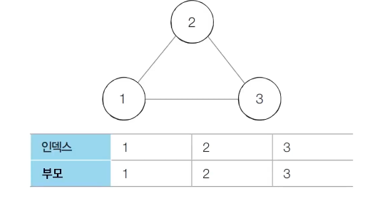
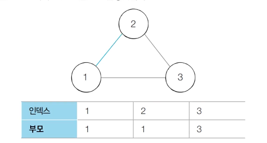

# Introduction

본 포스트는 알고리즘 학습에 대한 정리를 재대로 하기 위하여 남기는 것입니다. 더불어 기본 내용은 나동빈 저의 〖이것이 취업을 위한 코딩 테스트다〗라는 교재 및 유튜브 강의의 내용에서 발췌했고, 그 외 추가적인 궁금 사항들을 검색 및 정리해둔 것입니다.

# 기타 그래프 이론 : 서로소 집합을 활용한 사이클 판별

## 개념 설명

- 사이클에 대한 내용은 그래프 개념에 대한 이해가 필요합니다. 이에 대한 개념관련 정보는 [이 링크](https://ko.khanacademy.org/computing/computer-science/algorithms/graph-representation/a/describing-graphs)를 확인해 주세요.
- **사이클이란?(Cycle)** : 어떤 정점에서 시작하여 다시 자신에게 돌아오는 경로가 있는 경우 이를 **사이클(cycle)**이라고 합니다.
- 서로소 집합은 **무방향 그래프 내에서 사이클을 판별할 때** 사용할 수 있습니다.
  - 참고록 방향 그래프에서의 사이클 여부는 DFS를 이용하여 판별 할 수 있습니다.
- 사이클 판별 알고리즘은 다음과 같습니다.
  1.  각 선을 하나씩 확인하여 두 노드의 루트 노드를 확인합니다.
      1. 루트 노드가 서로 다르다면 두 노드의 합집합(Union) 연산을 수행합니다.
      2. 루트 노드가 서로 같다면 사이클(Cycle)이 발생한 것입니다.
  2.  그래프에 포함되어 있는 모든 간선에 대하여 1번 과정을 반복합니다.

## 동작 원리

- 초기 단계 : 모든 노드에 대하여 서로소 집합 알고리즘으로 초기화 시킵니다.
  

---

- 1단계 : 간선(1, 2)를 확인합니다. 노드 1, 2 중 더 큰 번호인 노드 2의 부모를 1로 변경합니다.
  

---

- 2단계 : 간선(1, 3)을 확인합니다. 노드 1, 3 중 동일한 로직으로 노드 3의 부모를 1로 변경합니다.
  

---

- 3단계 : 간선(2, 3)을 확인합니다. 이미 노드 2와 3은 루트 노드가 1임을 확인하고, **사이클이 발생함**을 확인합니다.
  

## 개념 예제(Python)

```python
# 특정 원소가 속한 집합을 찾기
def find_parent(parent, x):
	# 루트 노드를 찾을 때까지 재귀 호출
	if parent[x] != x:
		parent[x] = find_parent(parent, parent[x])
	return parent[x]

# 두 원소가 속한 집합 합치기
def union_parent(parent, a, b):
	a = find_parent(parent, a)
	b = find_parent(parent, b)
	if a < b:
		parent[b] = a
	else:
		parent[a] = b

# 노드의 개수와 간선(Union 연산)의 개수 입력 받기
v, e = map(int, input().split())
parent = [0] * (v + 1) # 부모 테이블 초기화

# 부모 테이블 상에서, 부모를 자기 자신으로 초기화
for i in range(1, v + 1):
	parent[i] = i

# 사이클 판별용 변수
cycle = False

for i in range(e):
	a, b = map(int, input().split())
	if find_parent(parent, a) == find_parent(parent, b):
		cycle = True
		break
		# 사이클 판별 시 종료
	else:
	# 사이클 발싱하지 않으면 합집합(union)연산 수행
		union_parent(parent, a, b)

if cycle:
	print("There is a cycle.")
else :
	print("There is not a cycle.")
```

## 개념 예제(C++)

```cpp
#include <bits/stdc++.h>

using namespace std;

int v, e;
int parent[100001];

int findParent(int x)
{
	if (x == parent[x])
		return (x);
	return parent[x] = findParent(parent[x]);
}

void unionParent(int a, int b)
{
	a = findParent(a);
	b = findParent(b);
	if (a < b)
		parent[b] = a;
	else
		paret[a] = b;
}

int main(void)
{
	cin >> v >> e;

	for (int i = 1; i <= v; i++)
		parent[i] = i;

	bool cycle = false;

	for (int i = 0; i < e; i++)
	{
		int a, b;
		cin >> a >> b;
		if (findParent(a) == findParent(b))
		{
			cycle = true;
			break ;
		}
		else
			unionParent(a, b);
	}

	if (cycle)
		cout << "There is a cycle." << '\n';
	else
		cout << "Threr is not a cycle." << '\n';

}

```

[🧑🏻‍💻 알고리즘 박살내기 시리즈🧑🏻‍💻](https://paul2021-r.github.io/algorithm/20220411_00/)

```toc

```
