# Introduction

본 포스트는 알고리즘 학습에 대한 정리를 재대로 하기 위하여 남기는 것입니다. 더불어 기본 내용은 나동빈 저의 〖이것이 취업을 위한 코딩 테스트다〗라는 교재 및 유튜브 강의의 내용에서 발췌했고, 그 외 추가적인 궁금 사항들을 검색 및 정리해둔 것입니다.

# 기타 그래프 이론 : 크루스칼 알고리즘

## 신장 트리

- **그래프에서 모든 노드를 포함하면서 사이클이 존재하지 않는 부분 그래프**를 의미합니다.
- 모든 노드가 서로 연결되면서 사이클이 존재하지 않는다는 조건의 트리 조건입니다. 이 특징을 요구하는 상황에서 효과적일 수 있습니다.

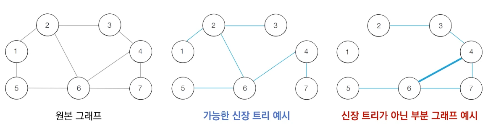_오른쪽은 1번 노드가 포함되지 않으므로 신장트리가 아니고, 사이클 발생하기에 신장트리가 아닙니다._

### 최소 신장 트리

- 위의 개념을 사용하는 경우는 어떤 경우일까요?
- 예시 ) N개의 도시가 존재하는 상황에서 두 도시 사이에 도로를 놓고 **전체 도시가 서로 연결**될 수 있게 도로를 설치해야 합니다.

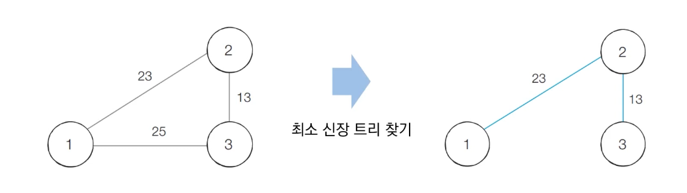_최소에, 그러나 순환하지 않는 노드 연결을 요구할 때 쓰면 됩니다._

## 크루스칼 알고리즘

- 대표적인 **최소 신장 트리 알고리즘**입니다.
- 그리디 알고리즘으로 분류됩니다.
- 구체적인 동작 과정은 아래와 같습니다.
  1.  간선 데이터를 비용에 따라 오름차순으로 정렬합니다.
  2.  간선을 하나씩 확인하며 현재의 간선이 사이클을 발생시키는지 확인합니다.
      - 사이클 미발생 : 최소 신장 트리에 포함
      - 사이클 발생 : 최소 신장 트리에 미포함
  3.  모든 간선에 대하여 2번 과정을 반복합니다.

## 동작 과정 살펴보기

- 최초 상태 : 원래는 오름차순 정렬을 하지만 표의 가독성을 위하여 노드 순서대로 표를 정리하였습니다.
  - 내부 알고리즘으로 가장 작은 코스트를 가진 연결 노드끼리 확인해 줍니다.

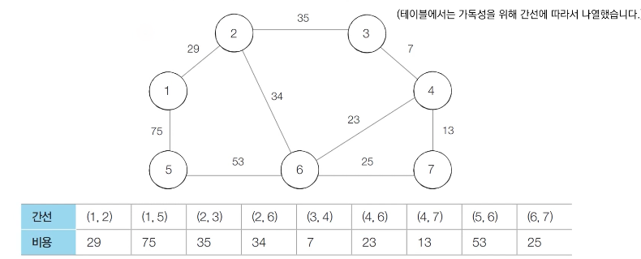

---

- Step 1 : 처리하지 않은 간선 중 가장 짧은 간선을 확인하면서 처리해 나갑니다.
  - 현재 가장 비용이 작은 노드는 3-4 입니다.
  - 이때 이들은 같은 집합에 속해있지 않은 상태(알고리즘으로 연결되는 과정이 최초니 당연한 이야기입니다.) union 함수를 통해 합집합을 만듭니다.

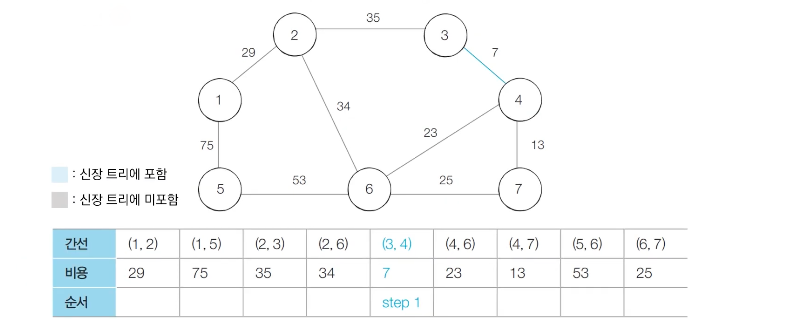

---

- Step 2 :
  - 1단계에서 했던 것과 동일한 알고리즘으로 4-7번 노드 간에 처리를 진행합니다.

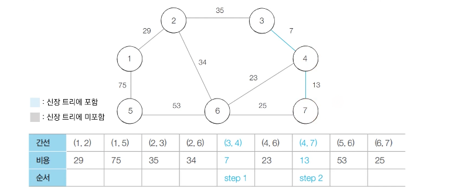

---

- Step 3 :
  - 1단계에서 했던 것과 동일한 알고리즘으로 4-7번 노드 간에 처리를 진행합니다.

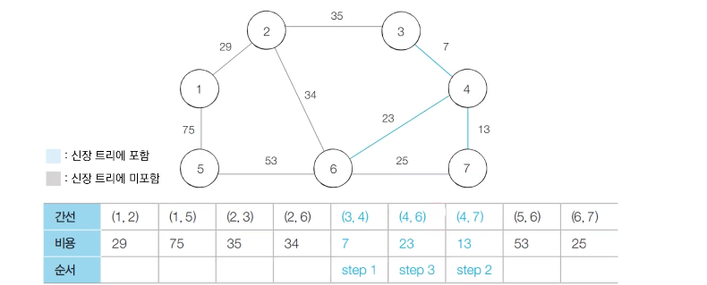

---

- Step 4 :
  - 6-7번 노드 간의 연산을 진행합니다.
  - 이때 6-7번 노드가 연결된다면 사이클이 발생하게 됩니다.
  - 따라서 해당 간선은 union 함수로 합집합 처리를 하지 않고 무시하고 넘어갑니다.(그림 상 점선 처리)

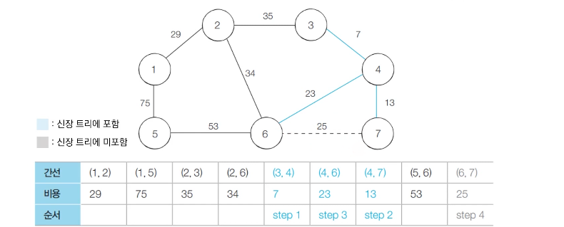

---

- Step 5 :
  - 1-2번 노드 간의 연산을 진행합니다.

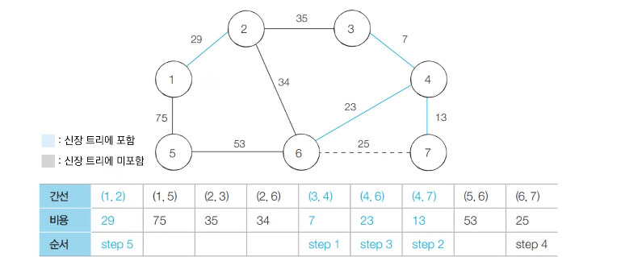

---

- Step 6 :
  - 2-6번 노드 간의 연산을 진행합니다.

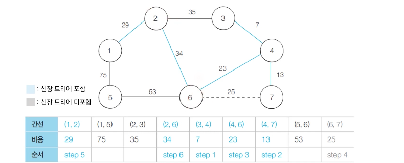

---

- Step 7 :
  - 2-3번 노드 간의 연산을 진행합니다.
  - 2, 3번 노드는 이미 집합안에 존재하므로 연산 수행하지 않습니다.

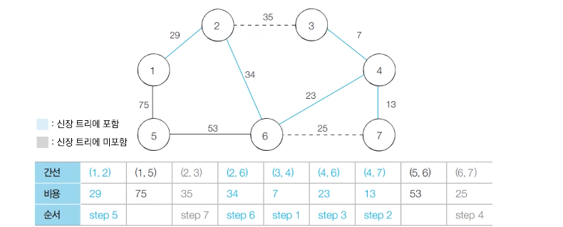

---

- Step 8 :
  - 5-6번 노드 간의 연산을 진행합니다.

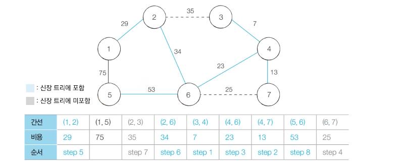

---

- Step 9 :
  - 1-5번 노드 간의 연산을 진행합니다.
  - 해당 노드들은 이미 속 해 있으니 연산을 수행하지 않습니다.

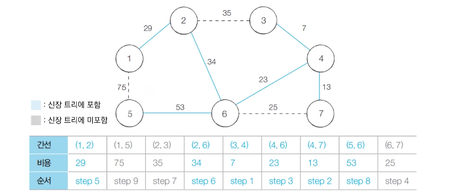

---

- 알고리즘 수행 결과 :
  - 최종적으로 신장 트리에 포함된 간선의 비용만 모두 더하면, 최소 신장 트리 비용을 구할 수 있게 됩니다.

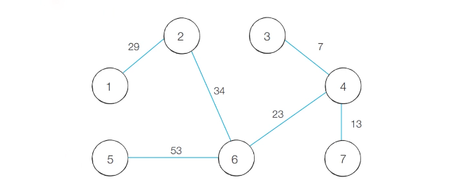

---

## 에시 코드

### Python 코드

```python
# 특정 원소가 속한 집합을 찾기
def find_parent(parent, x):
	# 루트 노드를 찾을 때가지 재귀호출
	if parent[x] != x:
		parent[x] = find_parent(parent, parent[x])
	return parent[x]

# 두 원소가 속한 집합을 합치기
def union_parent(parent, a, b):
	a = find_parent(parent, a)
	b = find_parent(parent, b)
	if a < b :
		parent[b] = a
	else :
		parent[a] = b

# 노드의 개수와 간선의 개수 입력받기
v, e = map(int, input().split())
parent = [0] *(v + 1)

# 모든 간선을 담을 리스트와 최종 비용을 담을 변수
edges = []
result = 0

# 부모 테비을 상에서 부모 자기 자신을 초기화
for i in range(1, v + 1):
	parent[i] = i

# 모든 간선에 대한 정보를 입력 받기
for _ in range(e):
	a, b, cost = map(int, input().split())
	# 비용 순으로 정렬을 위해 튜플 첫 원소를 비용으로 설정
	edges.append((cost, a, b))

# 간선을 비용 순으로 정렬
edge.sort()

# 간선을 하나씩 확인하면서 사이클이 발생하지 않는 경우에만 집합에 포함
for edge in edges :
	# edge의 안에 담긴 튜플 값을 분할함
	cost, a, b = edge
	# 사이클 발생 여부 확인, 사이클 발생하지 않으면 result에 코스트를 더합니다.
	if find_parent(parent, a) != find_parent(parent, b):
		union_parent(parent, a, b)
		result += cost

print(result)
```

### C++ 코드

```cpp
#include <bits/stdc++.h>

using namespace std;

int v, e;
int parent[100001];

vector<par<int, pair<int, int>>> edges; // 쌍 구조를 이중으로 활용함
int result = 0;

int findParent(int x)
{
	if (x == parent[x])
		return x;
	return parent[x] = findParent(parent[x]);
}

void	unionParent(int a, int b)
{
	a = findParent(a);
	b = findParent(b);
	if (a < b)
		parent[b] = a;
	else
		parent[a] = b;
}

int main(void)
{
	cin >> v >> e;

	for (int i = 1; i <= v; i++)
		parent[i] = i;

	for (int i = 0; i < e; i++)
	{
		int a, b, cost;
		cin >> a >> b >> cost;
		edges.push_back({cost, {a, b}});
	}

	sort(edges.begin(), edges.end());

	for (int i = 0; i < edges.size(); i++)
	{
		int cost = edges[i].first;
		int a = edges[i].second.first;
		int b = edges[i].second.second;
		if(findParent(a) != findParent(b))
		{
			unionParent(a, b);
			result += cost;
		}
	}
	cout << result << '\n';
}

```

## 크루스칼 알고리즘 성능 분석

- 간선의 개수가 𝑬개일 때 𝑂(𝑬𝑙𝑜𝘨𝑬) 의 시간 복잡도를 가집니다.
- 크루스칼 알고리즘에서 가장 많은 시간을 요구하는 곳은 **간선을 정렬을 수행**하는 부분입니다.
  - 표준 라이브러리를 이용해 𝑬개의 데이터를 정렬하기 위한 시간 복잡도가 𝑂(𝑬𝑙𝑜𝘨𝑬)입니다.

[🧑🏻‍💻 알고리즘 박살내기 시리즈🧑🏻‍💻](https://paul2021-r.github.io/algorithm/20220411_00/)

```toc

```
