# Introduction

본 포스트는 알고리즘 학습에 대한 정리를 재대로 하기 위하여 남기는 것입니다. 더불어 기본 내용은 나동빈 저의 〖이것이 취업을 위한 코딩 테스트다〗라는 교재 및 유튜브 강의의 내용에서 발췌했고, 그 외 추가적인 궁금 사항들을 검색 및 정리해둔 것입니다....

# 기타 그래프 이론 : 위상정렬

## 위상 정렬의 개요

- <span style="color:red">사이클이 없는 방향의 그래프</span>의 모든 노드를 **방향성에 거스르지 않도록 순서대로 나열하는 것**을 의미합니다.
- 예시) 선수과목을 고려한 학습 순서 설정

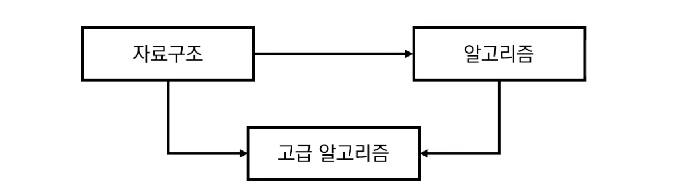_고급 알고리즘은 양쪽 과목을 모두 배운다는 조건이 성립되어야 한다._

- 위 세 과목을 모두 듣기 위한 적절한 학습 순서는?
  - 자료구조 ➡︎ 알고리즘 ➡︎ 고급 알고리즘 <span style="color:blue">(O)</span>
  - 자료구조 ➡︎ 고급 알고리즘 ➡︎ 알고리즘 <span style="color:red">(X)</span>

## 진입차수와 진출차수

- 그래프 관련하여 알아두면 좋은 개념으로 먼저 소개하겠습니다.
- 진입차수(Indegree): 특정한 노드로 들어오는 간선의 개수
- 진출차수(Outdegree): 특정한 노드에서 나가는 간선의 개수

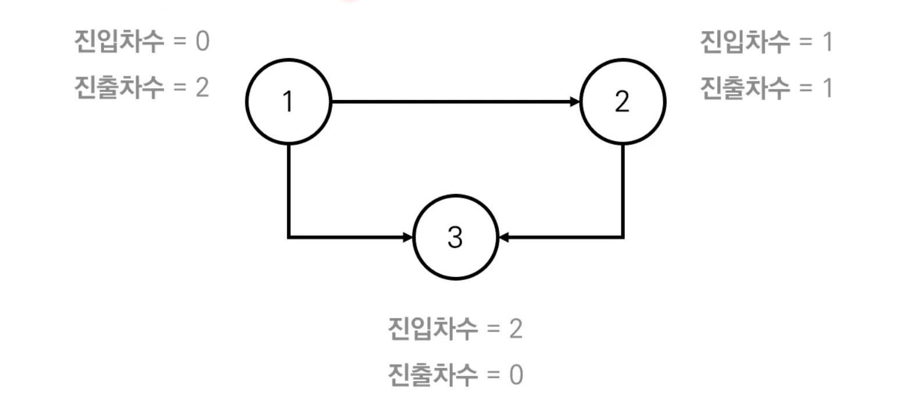

## 위상 정렬 알고리즘이란

- 본래 위상 정렬은 DFS나 큐로 구현이 가능합니다.
- 나동빈 저자의 교재에서는 큐를 이용하는 위상정렬 알고리즘을 소개합니다. 동작과정은 아래와 같습니다.

  1.  진입차수가 0인 모든 노드를 큐에 넣는다.
  2.  큐가 빌때까지 다음 과정을 반복합니다.<br> 1. 큐에서 원소를 꺼내 해당 노드가 나가는 간선을 그래프에서 제거합니다.<br> 2. 새롭게 진입차수가 0이 된 노드를 큐에 넣는다.<br/>

- 중요하게 알아야 하는 것은 사이클이 있을 경우 위상 정렬이 불가능합니다. 사이클이 없는 방향 그래프(DAG)이여야 합니다.<br>

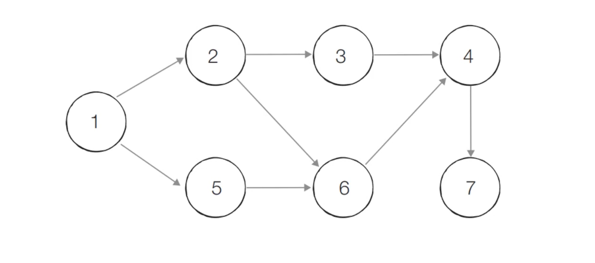<br>

➡︎ <span style="color:red">결론적으로 각 노드가 **큐에 들어온 순서가 위상 정렬을 수행한 결과**와 같습니다.</span>

## 위상 정렬 동작의 예시

- 초기 단계 : 최초 입력된 노드 중 진입차수가 0인 모든 노드를 큐에 넣습니다.
  - 최초 노드 1이 진입차수가 0이므로 큐애 입력됩니다.

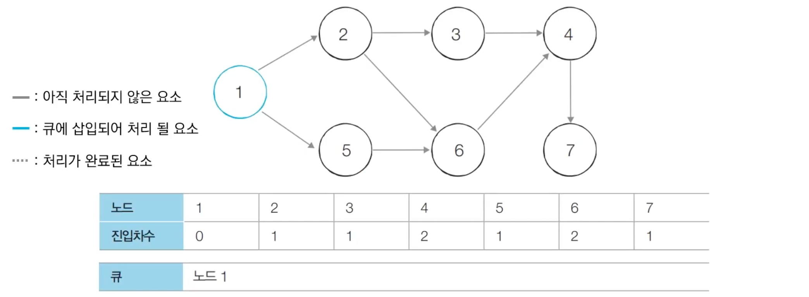

---

- Step 1 :
  - 노드 1을 꺼내고 1에서 나가는 간선을 제거합니다.
  - 이때 진입차수가 0이 된, 2, 5를 큐에 삽입합니다.

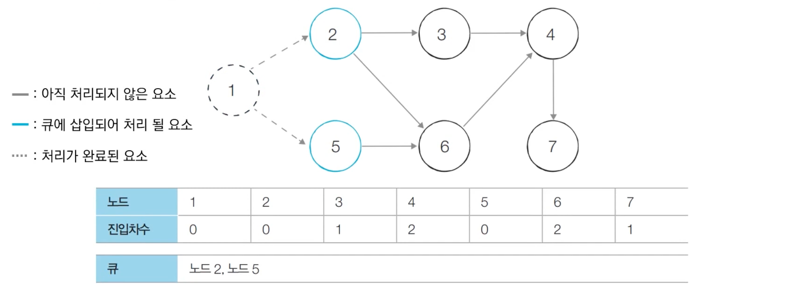

---

- Step 2 :
  - 노드 2를 먼저 꺼내 나가는 간선을 제거합니다.
  - 이때 진입차수를 확인하여 0이 된 노드(3)를 큐에 삽입합니다.

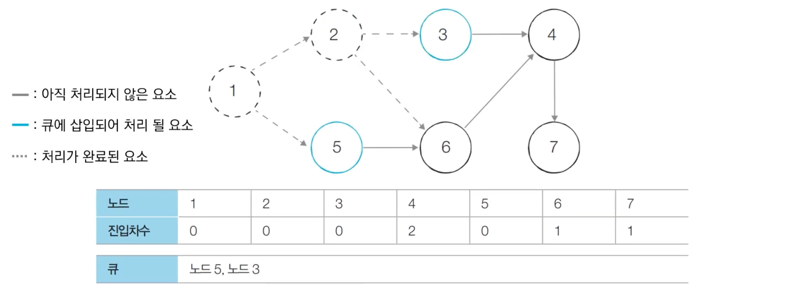

---

- Step 3 :
  - 노드 5를 꺼내 나가는 간선을 제거합니다.
  - 진입차수가 0이 된 6을 큐에 삽입합니다.

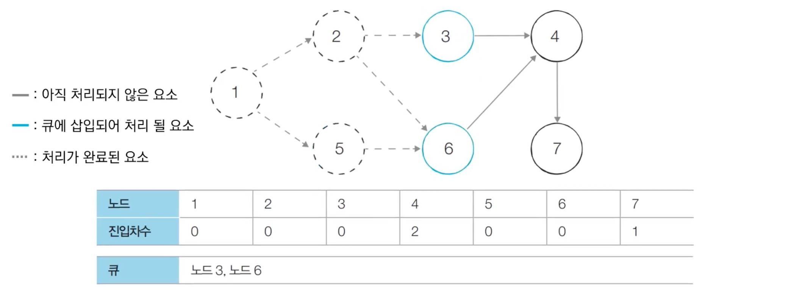

---

- Step 4 :
  - 큐에서 노드 3을 꺼내고 간선을 제거합니다.
  - 이 경우 4를 3, 6이 동시에 가리키고 있어 노드 4의 진입차수는 여전히 1입니다. 이에 큐에 넣지 않습니다.

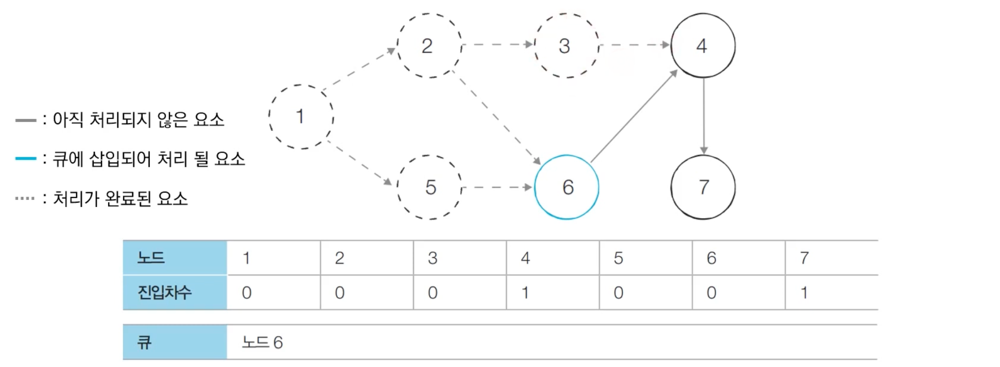

---

- Step 5 :
  - 큐에서 노드 6을 꺼내고 간선을 제거합니다.
  - 6이 제거됨과 함께 진입차수가 0이된 4를 큐에 삽입합니다.

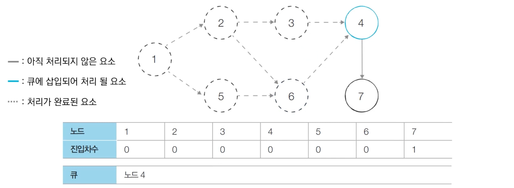

---

- Step 6 :
  - 큐에서 노드 4를 꺼내고 간선을 제거합니다.
  - 큐에 노드 7을 삽입합니다.

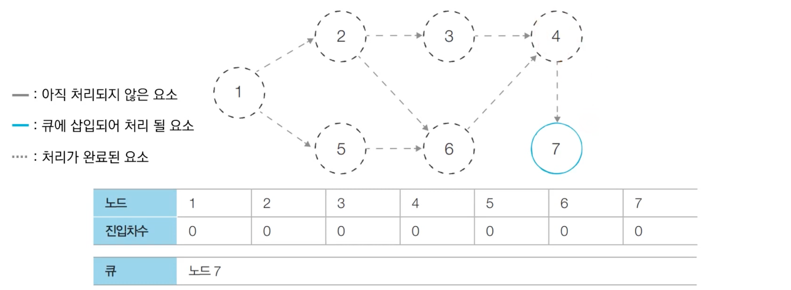

---

- Step 7 :
  - 큐에서 7을 꺼내지만, 제거할 진출간선이 없으므로 그대로 종료합니다.
  - 큐에 넣을 추가 노드도 없으므로 종료합니다.

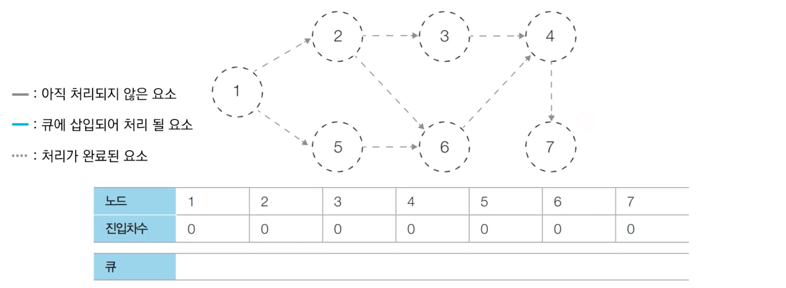

---

- 위상 정렬 종료 :
- 최종적으로 큐에 삽입된 전체 노드의 순서는 1 ➡︎ 2 ➡︎ 5 ➡︎ 3 ➡︎ 6 ➡︎ 4 ➡︎ 7 로 확정됩니다.

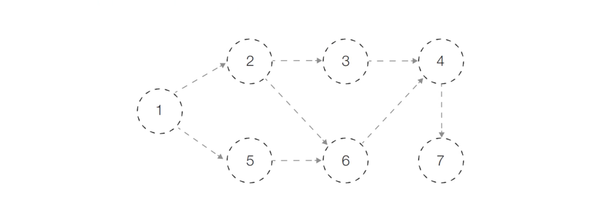

---

## 위상 정렬의 특징

- 위상정렬은 DAG에 대해서만 수행할 수 있습니다.
  > 'DAG(Direct Acyclic Graph' : 순환하지않는 방향 그래프
- 위상 정렬에서는 **여러가지 답**이 존재할 수 있습니다.
  > 한 단계에서 큐에 새롭게 들어가는 원소가 2개 이상인 경우가 있다면 여러가지 답이 존재합니다.(2개 이상의 큐가 동일한 순간에 들어간다면, 그 노드들 중 어느걸 골라도 큰 문제는 없습니다.)<br>
  > 따라서 문제의 요구에 따라 기준을 추가로 구현하면 그 선택으로 답이 여러가지 형태로 나올 수 있습니다.
- 모든 원소를 방문하기 전에 큐가 빈다면 사이클이 존재한다고 판단할 수 있습니다.
  > 사이클에 포함된 원소 중 어떤 원소도 큐에 들어가지 못합니다.
- 스택을 활용한 DFS를 이용해 위상정렬을 구현할 수도 있습니다.

## 코드로 구현한 위상정렬 알고리즘

### Python

```python
from collections import deque

# 노드의 개수와 간선의 개수를 입력 받기
v, e = map (int, input().split())
# 모든 노드에 대한 진입차수 초기화
indegree = [0] * (v + 1)
# 각 노드의 연결된 간선 정보를 담을 연결리스트
graph = [[] for i in range(v + 1)]

# 방향 그래프의 모든 간선 정보를 입력 받기
for _ in range(e):
	a, b = map(int, input().split())
	graph[a].append(b)
	indegree[b] += 1

# 위상 정렬 함수
def topology_sort():
	# 수행 결과물 담을 리스트
	result = []
	# 큐 기능으로 쓸 뎈
	q = deque()
	# 진입 차수가 0인 노드들을 큐에 삽입한다.
	for i in range(1, v + 1):
		if indegree[i] == 0:
			q.append(i)

	# 큐가 비어질 때까지 반복합니다.
	while q:
		# 현재 큐에서 노드를 빼고
		now = q.popleft()
		# 결과에 기록한 뒤
		result.append(now)
		# 그래프에서 노드가 연결된 노드들에 대해 1을 뺍니다.
		for i in graph[now]:
			indegree[i] -= 1
			# 만약 진입차수가 0인 노드는 다시 q에 집어 넣습니다.
			if indegree[i] == 0:
			q.append(i)
	for i in result :
		print(i, end = ' ')

topology_sort()

# 입력 예시

7 8
1 2
1 5
2 3
2 6
3 4
4 7
5 6
6 4
# 출력 예시
1 2 5 3 6 4 7
```

### C++

```cpp
#include <bits/stdc++.h>

using namespace std;

int v, e;
int indegree[100001];
vector<int> graph[100001];

void topologySort()
{
	vector<int> result;
	queue<int>	q;

	for (int i = 1; i <= v; i++)
		if (indegree[i] == 0)
			q.push(i);
	while (!q.empty())
	{
		int now = q.front();
		q.pop();
		result.push_back(now);
		for (int i = 0; i < graph[now].size(); i++)
		{
			indegree[graph[now][i]] -= 1;
			if (indegree[graph[now][i]] == 0)
				q.push(graph[now][i]);
		}
	}

	for (int i = 0; i < result.size(); i++)
		cout << result[i] << ' ';
}

int main(void)
{
	cin >> v >> e;

	for (int i = 0; i < e; i++>)
	{
		int a, b;
		cin >> a >> b;
		graph[a].push_back(b);
		indegree[b] += 1;
	}

	topologySort();
}
```

## 위상 정렬 알고리즘 성능 분석

- 위상 정렬을 위해 차례대로 모든 노드를 확인하며 각 노드에서 나가는 간선을 차례대로 제거해야 합니다.
- 위상 정렬 알고리즘은 위의 로직으로 인해 추가적으로 노드를 다시 점검할 필요가 없어져 시간 복잡도가 𝑂(𝑉 + 𝑬)로 상수 시간입니다.

[🧑🏻‍💻 알고리즘 박살내기 시리즈🧑🏻‍💻](https://paul2021-r.github.io/algorithm/20220411_00/)

```toc

```
