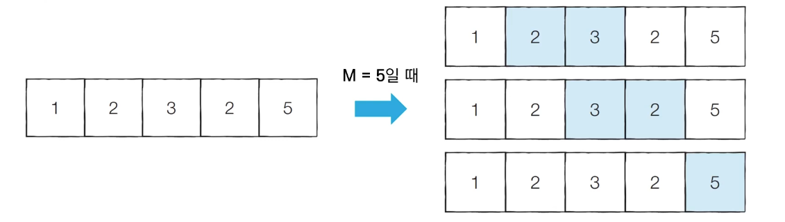

# Introduction

본 포스트는 알고리즘 학습에 대한 정리를 재대로 하기 위하여 남기는 것입니다. 더불어 기본 내용은 나동빈 저의 〖이것이 취업을 위한 코딩 테스트다〗라는 교재 및 유튜브 강의의 내용에서 발췌했고, 그 외 추가적인 궁금 사항들을 검색 및 정리해둔 것입니다....

# 기타 알고리즘 : 투 포인터(Two Pointers)

## 개요

- 투 포인터 알고리즘은 리스트에 순차적으로 접근해야 할 때 두 개의 점의 위치를 기록하면서 처리하는 알고리즘을 의미합니다.
- 예를들어 2, 3, 4, 5, 6, 7번 학생을 지목한다고 할 때, 간단하게 **2번부터 7번까지의 학생**이라고 지목하면, 그 특정 범위 전체를 의미하게 됩니다.
- 리스트에 담긴 데이터에 순차적으로 접근해야할 때 시작점과 끝점 2개의 점으로 접근할 데이터의 범위를 표현할 수 있습니다.

## 특정한 합을 가지는 부분 연속 수열 찾기

### 문제 설명

- N개의 자연수로 구성된 수열이 있다고 할 때, 합이 **M**인 부분 연속 수열의 개수를 구해보세요.
- 수행 시간 제한은 𝑂(𝑁)입니다.



### 문제 해결 아이디어

- 이 문제 예시를 선형시간 안에 해결하려면 투 포인터를 활용하여, 다음 알고리즘 문제를 해결할 수 있습니다.
  1.  시작점과 끝점이 첫 번째 원소의 인덱스(0)을 가리키도록 합니다.
  2.  현재 부분 합이 M과 같다면 카운트 합니다.
  3.  현재 부분 합이 M보다 작다면 end를 1 증가 시킵니다.
  4.  현재 부분 합이 M보다 크거나 같다면, 시작점을 1 증가 시킵니다.
  5.  해당 경우 모두 확인할 때까지 2 ~ 4번 과정을 반복합니다.

### 코드 예시

#### Python

```python
n = 5 # 데이터 개수
m = 5 # 찾을 부분의 합
data = [1, 2, 3, 2, 5] # 전체 수열

count = 0
interval_sum = 0
end = 0

# start를 차례대로 증가 시키기
for start in range(n):
	# end 를 가능한 만큼 앞으로 이동
	while interval_sum < m and end < n:
		interval_sum += data[end]
		end += 1
	# 부분합이 M에 도달 하면 카운트 아니면, 더 더해야 합니다.
	if interval_sum == m:
		count += 1
	interval_sum -= data[start]

print(count)
```

#### C++

```cpp
#include <bits/stdc++.h>

using namespace std;

int n = 5;
int m = 5;
int arr[] = {1, 2, 3, 2, 5};

int main(void)
{
	int cnt = 0;
	int intervalSum = 0;
	int end = 0;

	for (int start = 0; start < n; start++)
	{
		while(intervalSum < m && end < n)
		{
			intervalSum += arr[end];
			end += 1;
		}
		if (intervalSum == m)
			cnt += 1;
		intervalSum -= arr[start];
	}
	cout << cnt << '\n';
}
```

[🧑🏻‍💻 알고리즘 박살내기 시리즈🧑🏻‍💻](https://paul2021-r.github.io/algorithm/20220411_00/)

```toc

```
