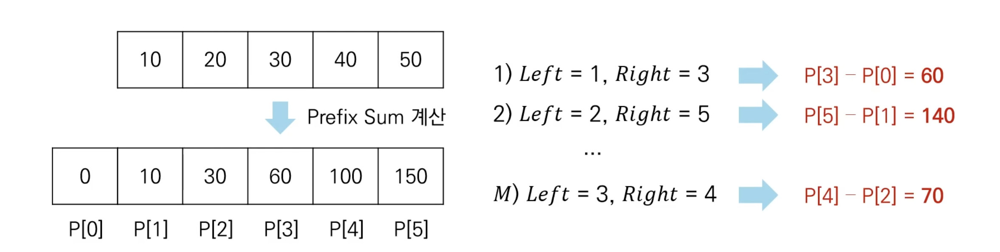

# Introduction

본 포스트는 알고리즘 학습에 대한 정리를 재대로 하기 위하여 남기는 것입니다. 더불어 기본 내용은 나동빈 저의 〖이것이 취업을 위한 코딩 테스트다〗라는 교재 및 유튜브 강의의 내용에서 발췌했고, 그 외 추가적인 궁금 사항들을 검색 및 정리해둔 것입니다....

# 기타 알고리즘 : 구간 합 빠르게 계산하기

## 구간 합(Interval Sum)

- 구간 합 문제 : 연속적으로 나열된 N개의 수가 있을 때
- 예를 들어 5개의 데이터로 구성된 수열 {10, 20, 30, 40, 50} 이 있다고 가정 시, 두 번째 수부터 네 번째 수까지의 합은? → 20 + 30 + 40 = 90 입니다.
- 선형 탐색이 가능하나, 이러한 요구가 여러번 들어올 때 처리하는 방법을 배워 봅시다.

## 구간 합 빠르게 계산하기

### 문제 설명

- N개의 정수로 구성된 수열이 있습니다.
- M개의 쿼리(Query) 정보가 주어집니다.
  - 각 쿼리는 왼쪽(left)과 오른쪽(right)으로 구성됩니다.
  - 각 쿼리에 대하여 [left, right] 구간에 포함된 데이터 들의 합을 출력해야 합니다.
- 수행 시간 제한은 𝑶(𝑵 + 𝑴)입니다.
  - 만약 선형으로 매 쿼리마다 다시 합을 재는 방식으로 진행이 된다면, 𝑶(𝑵 ✕ 𝑴) 의 시간이 소요되다보니, 요구하는 수행시간을 지킬 수 없게 됩니다.

### 문제 해결 아이디어

- 접두사 합(Prefix Sum) : 배열의 맨 앞부터 특정 위치까지의 합을 미리 구해 놓는 방식을 활용해야 합니다.
- 접두사 합을 활용하는 알고리즘은 다음과 같습니다.
  - N개의 수 위치 각각에 대하여 접두사 합을 계산하여 P에 저장합니다.
  - 매 M개의 쿼리 정보를 확인할 때 구간 합은 P[right] - P[left - 1]로 구해 냅니다.



### 코드 예시

#### Python

```python
# 데이터 개수와 각 데이터의 값
n = 5
data = [10, 20, 30, 40, 50]

# 접두사 합 알고리즘의 배열 계산
sum_value = 0
prefix_sum = [0]
for i in data:
	sum_value += 1
	prefix_sum.append(sum_value)

left = 3
right = 4

print(prefix_sum[right] - prefix_sum[left - 1])

# 실행 결과
70
```

#### C++

```cpp
#include<bits/stdc++.h>

using namespace std;

int n = 5;
int data[n] = {10, 20, 30, 40, 50};
int prefix_sum[6];

int main(void)
{
	int sumValue = 0;

	for(int i = 0; i < n; i++)
	{
		sumValue += arr[i];
		prefixSum[i + 1] = sumValue;
	}

	int left = 3;
	int right = 4;
	cout << prefixSum[right] - prefixSum[left - 1] << '\n';
}
```

[🧑🏻‍💻 알고리즘 박살내기 시리즈🧑🏻‍💻](https://paul2021-r.github.io/algorithm/20220411_00/)

```toc

```
