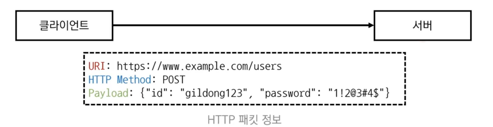

# Introduction

본 포스트는 알고리즘 학습에 대한 정리를 재대로 하기 위하여 남기는 것입니다. 더불어 기본 내용은 나동빈 저의 〖이것이 취업을 위한 코딩 테스트다〗라는 교재 및 유튜브 강의의 내용에서 발췌했고, 그 외 추가적인 궁금 사항들을 검색 및 정리해둔 것입니다....

# 개발형 코딩 테스트

## 개념

- 정해진 목적에 따라서 동작하는 완성된 프로그램을 개발하는 것이 목표인 코딩테스트 유형입니다.
- 알고리즘 코딩 테스트 vs 개발형 코딩 테스트
  - 알고리즘 형
    - 시간 복잡도 분석
    - 공간 복잡도 분석
  - 개발 형
    - 완성도 높은 하나의 프로그램을 개발
    - 모듈을 적절히 조합하는 능력을 요구
- 일부 기업은 해커톤을 통해 채용을 진행하기도 합니다.
  - 해커톤(Hackaton)이란 단 기간에 아이디어를 제품화 하는 프로젝트 이벤트 입니다.
  - 대게 1 ~ 2일 정도 진행되며 다수의 해커톤이 대회 형식을 빌려 해커톤이 끝나면 프로그램을 시연하고 발표하고, 채점을 진행하는 형태입니다.
- 이러한 개발형 코딩테스트는 분야나 직군별로 당연히 원하는 상세 요구는 다를 수 있으며, 해당 영역의 능력은 본인의 몫입니다.
- 그러나 분야와 상관없이 꼭 알아야 하는 개념들이 존재하고, 이를 통해 협업을 해내고, 소통력을 통해 문제 해결에 필요한 기본적인 역량이 필요해 집니다.
- 이번 시간은 알고리즘 개요의 마지막으로 이러한 공통 개념을 정리하고 마무리 하려고 합니다.

## 서버와 클라이언트

- 클라이언트가 요청(Request)을 보내면 서버가 응답(Response)합니다.

### 클라이언트(Client) = 고객

- 서버의 요청을 보내고, 응답이 도착할 때까지 기다립니다.
- 서버로부터 응답을 받은 뒤에는 서버의 응답을 화면에 출력합니다.

### 서버(Server) = 서비스 제공자

- 클라이언트로부터 받은 요청을 처리하여 응답을 전송합니다.
- 서버는 실제로는 다양한 디바이스가 해줄 수 있으므로, 단순히 서버로 나온 제품만이 서버역할을 하는 것은 아닙니다.

## HTTP 개요

- HTTP (Hyper Text Transfer Protocol)는 웹 상에서 데이터를 주고받기 위한 프로토콜을 의미합니다.
  - 보통은 웹 문서(HTML 파일)를 주고 받는 데 사용됩니다.
  - 모바일 앱 및 게임 개발 등에서 특정 형식의 데이터를 주고 받는 용도로 사용됩니다.
- 클라이언트는 요청의 목적에 따라서 적절한 HTTP 메서드를 이용해 통신을 진행합니다.
  - 대표적인 HTTP 메서드는 다음과 같습니다.
    - GET : 특정 데이터 조회를 요청합니다.
    - POST : 특정 데이터 생성을 요청합니다.
    - PUT : 특정 데이터의 수정을 요청합니다.
    - DELETE : 특정 데이터의 삭제를 요청합니다.
  - 단, 알아야 할 것은 해당하는 메서드는 일종의 약속으로 API 마다 다른 방식으로 구현되거나 요구될 수 있어서, 무조건 이렇게만 하면 된다는 식으로 생각하면 안됩니다.

### 파이썬 웹 요청 예제 : GET 방식

```python
import requests

target = "http://google.com"
response = requests.get(url=target)
print(response.txt)

# 실행 결과
<!doctype html><html itemscope=" "...
```

### 개발형 코딩 테스트 핵심 개념

- 2020년 카카오 2차 코딩 테스트 안내문에 쓰여있던 문장입니다.
  > “오프라인 코딩 테스트에서는 JSON format의 데이터를 응답하는 REST API를 활용해야 하니, REST API 호출과 JSON format 데이터를 파싱해 활용할 수 있는 parser코드를 미리 준비해 오시기 바랍니다.”
- 개발형 코딩 테스트의 핵심 키워드 : REST API, JSON

### REST 등장 배경

- HTTP 는 GET, POST, PUT, DELETE 등 다양한 메서드를 지원합니다.
  - 실제로는 서버가 각 메서드의 기본 설명을 따르지 않아도 프로그램을 개발할 수 있습니다.
  - 하지만 저마다 다른 방식의 개발이 되면 문제가 되므로 기준이되는 아키텍처가 필요합니다.

### REST 개요

- REST(Representational State Transfer)는 각 자원에 대하여 자원의 상태에 대한 정보를 주고 받는 개발 방식을 의미합니다.
- REST 구성 요소
  - 자원(Resource) : URI를 이용 << 사용자
  - 행위(Verb) : HTTP 메서드를 이용 << 회원 등록
  - 표현(Reprsentations) : 페이 로드를 이용 << 상세 내용




### REST API 란?

- API(Application Programming Interface) : 프로그램이 상호작용하기 위한 인터페이스를 의미합니다.
- REST API : REST 아키텍처를 따르는 API를 의미합니다.
- REST API 호출 : REST 방식을 따르고 있는 서버에 특정한 요청을 전송하는 것을 의미합니다.
- 그런데 이런 데이터 자체에 대한 포맷은 어떻게 구성이 될까? → JSON

### JSON 포맷

- JSON(JavaScript Object Notation) : 데이터를 주고 받는데 사용하는 경량의 데이터 형식입니다.
  - 파이썬의 사전 방식과 유사한 형태를 띕니다.
- JSON 형식을 따른 데이터 예시는 다음과 같습니다.
  ```json
  {
    "id": "gildong123",
    "password": "1!2@3#4$",
    "age": 30,
    "hobby": ["football", "programmin"]
  }
  ```
- JSON 데이터는 키와 값의 쌍으로 이루어진 데이터 객체를 저장한니다.

### JSON 객체 사용 예제

```python
import json

# 사전 자료형(dict)로 데이터 선언
user = {
	"id": "gildong",
	"password": "1!2@3#4$",
	"age": 30,
	"hobby": ["football", "prgoramming"]
}

# 파이썬의 변수를 JSON객체로 변환
json_data = json.dumps(user, indent=4)
print(json_data)
```

### JSON 객체 파일 저장 예제

```python
import json

user = {
	"id": "gildong",
	"password": "1!2@3#4$",
	"age": 30,
	"hobby": ["football", "prgoramming"]
}

# JSON 데이터로 변환하여 파일로 저장
with open("user.json", "w", encoding="utf-8") as file:
	json_data = json.dump(user, file, indent=4)
```

### REST API 연습용 서비스

- 목킹(Mocking)이란 어떤 기능이 있는 것처럼 흉내내어 구현한 것입니다.
- 가상 REST API 제공 서비스 :
  https://jsonplaceholder.typicode.com

## REST API 호출 실습

- API 호출 경로 : https://jsonplaceholoder.typicode.com/users/1
- HTTP 메서드 : GET
  ```json
  {
  	"id": 1,
  	"name": "Leanne Grahm",
  	"username": "Bret",
  	"emain": "Sincere@april.biz",
  	(생략)...
  }
  ```
- 해당 방식으로 데이터를 받아올 순 있으나, 실제로 사용하는 경우엔 인증과 보안, 권한 문제로 적절한 토큰을 함께 보내는 방식을 씁니다.
- 위의 실습용 사이트는, 가상으로 진행하는 것이기에 별도의 인증은 필요 없습니다.
- 해당 사이트를 활용하면 클라이언트 측에서 가상의 사용자를 만들어 사용하는 실습이 가능합니다.
- 사용자 전체에 대한 호출
  https://jsonplaceholoder.typicode.com/users
  - HTTP 메서드 : GET
    ```json
    [
    	{
    		"id": 1,
    		"name": "Leanne Grahm",
    		"username": "Bret",
    		"emain": "Sincere@april.biz",
    		(생략)...
    	},
    	{
    		"id": 1,
    		"name": "Leanne Grahm",
    		"username": "Bret",
    		"emain": "Sincere@april.biz",
    		(생략)...
    	}
    	(생략)...
    ]
    ```

### REST API를 호출하여 회원 정보를 처리하는 예제

```python
import request

# REST API경로 접속하여 응답 데이터 받아오기
target = "https://jsonplaceholder.typicode.com/users"
response = requests.get(url=target)

# 응답 데이터를 JSON식으로 받아서, 파이썬 객체로 변환
data = response.jseon()

# 모든 사용자 정보를 확인하며 이름 정보만 삽입
name_list = []
for user in data:
	name_list.append(user["name"])

print(name_list)
```


[🧑🏻‍💻 알고리즘 박살내기 시리즈🧑🏻‍💻](https://paul2021-r.github.io/algorithm/20220411_00/)

```toc

```
